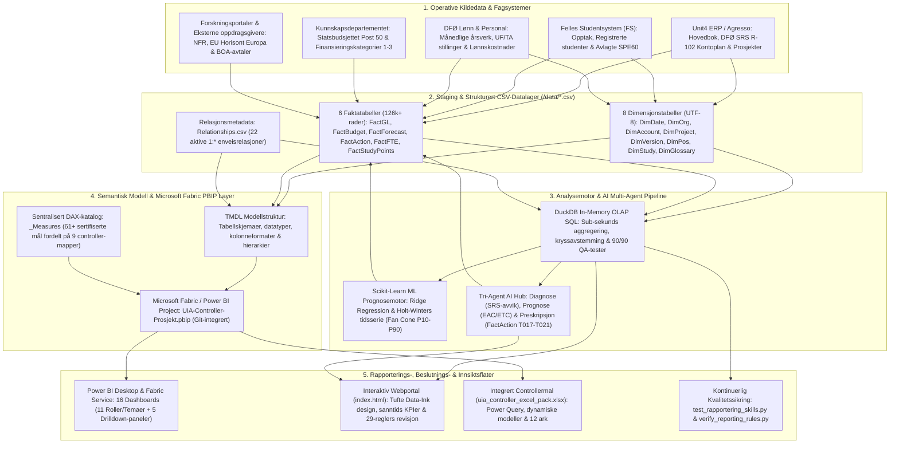
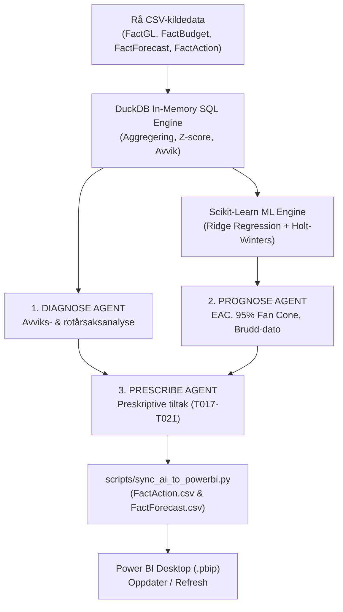
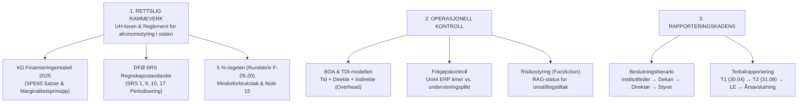
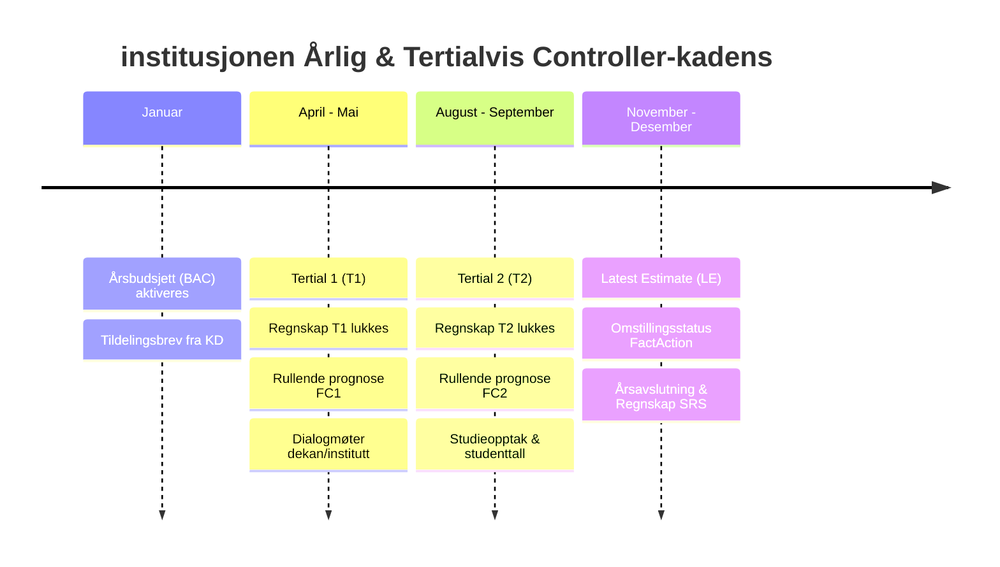
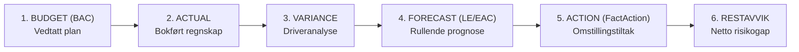

# Universitetet i Agder (UiA) – Helhetlig Virksomhetsstyring & Forecast Datamodell (Power BI / PBIP)

[](https://powerbi.microsoft.com/)
[](https://learn.microsoft.com/power-bi/developer/projects/projects-overview)
[](https://dfo.no/)
[](index.html)
[](index.html)
[](index.html)
[](scripts/ai_engine.py)
[](app.py)
[](https://www.edwardtufte.com/)
[](app.py)

Dette prosjektet representerer en **autoritativ og produksjonsklar virksomhetsstyrings- og prosjektcontroller-løsning for Universitetet i Agder (UiA)**, 100 % harmonisert med styringskravene, læreplanene og regnskapsdataene i `Use Case/`. Løsningen er bygget på **Microsoft Fabric / Power BI Project-formatet (`.pbip` med TMDL)**, og integrerer regnskap (DFØ SRS), periodiserte budsjetter, rullende tertialprognoser (EAC/ETC), omstillingstiltak (gevinstrealisering), bemanningsutvikling (årsverk), student- og studieproduksjon (SPE60) og fullkostkalkyle for eksternfinansiert forskning (BOA/TDI).

Rapporteringssuiten består av **16 spesialtilpassede dashboards** (inkludert 4-Soners **Dekanens Dashbord**, dedikert **Statlig Regelverkskontroll (UC1–UC6)**, **Læreplaner & Budsjettering**, **BOA TDI Prosjektstyring** og **AI Controller Hub**) utformet strengt etter **Edward Tuftes prinsipper for Data-Ink Ratio**.

### Hurtigstart & Lenker:
* 👉 [**Åpne Web Dashboard Portalen (`index.html`)**](index.html)
* 📑 [**Utforsk Veileder for Kontroll & Rapportering (`rapportering skills/SKILL.md`)**](rapportering%20skills/SKILL.md)
* 🚀 [**Kjøre den interaktive Controller-applikasjonen (`app.py`)**](http://127.0.0.1:8088) (Port 8088)
* ⚡ [**Oppdatere Power BI med ferske KI-tiltak (`scripts/sync_ai_to_powerbi.py`)**](scripts/sync_ai_to_powerbi.py)

---

## Innholdsfortegnelse
1. [Forretningsmessig Kontekst & Statlige Use Cases (UC1–UC6)](#1-forretningsmessig-kontekst--statlige-use-cases-uc1uc6)
2. [Kunnskapsdepartementets Finansieringsmodell 2025 & Læreplaner](#2-kunnskapsdepartementets-finansieringsmodell-2025--læreplaner)
3. [BOA TDI Fullkostkalkyle (T+D+I)](#3-boa-tdi-fullkostkalkyle-tdi)
4. [Mappestruktur & Prosjektorganisering](#4-mappestruktur--prosjektorganisering)
5. [Datamodellens Arkitektur & Stjerneskjema (16 Tabeller, 23 Relasjoner)](#5-datamodellens-arkitektur--stjerneskjema-16-tabeller-23-relasjoner)
6. [DAX-målkatalog & Beregningslogikk](#6-dax-målkatalog--beregningslogikk)
7. [4-Soners Dekanens Dashbord & Komplett Rapportsuite (16 Paneler)](#7-4-soners-dekanens-dashbord--komplett-rapportsuite-16-paneler)
8. [AI Multi-Agent Hub & Maskinlæring (Diagnose, Prognose, Preskripsjon)](#8-ai-multi-agent-hub--maskinlæring-diagnose-prognose-preskripsjon)
9. [Edward Tufte Visualiseringsstandarder](#9-edward-tufte-visualiseringsstandarder)
10. [Installasjon & Utviklerveiledning](#10-installasjon--utviklerveiledning)

---

## 1. Forretningsmessig Kontekst & Formål

Universitets- og høyskolesektoren (UH-sektoren) er gjenstand for betydelige strukturelle endringer:
* **Bevilgningsmodell under press**: Kunnskapsdepartementets (KD) finansieringssystem kombinerer en fast grunnbevilgning med resultatbasert uttelling for studiepoengproduksjon (SPE60/kandidater) og ekstern forskningsfinansiering (BOA).
* **Demografiske endringer & omstilling**: Lavere studentkull fordrer streng dimensjonering av studieporteføljen, optimalisering av bemanningsforhold (studenter per vitenskapelig årsverk) og stram kostnadskontroll.
* **Statlige Regnskapsstandarder (DFØ SRS)**: institusjonen fører regnskap etter SRS (opptjeningsprinsippet), hvor inntekter fra bevilgning periodiseres i takt med påløpte kostnader, mens BOA-prosjekter inntektsføres etter fullført kontrakt eller påløpt fremdrift.

### Formål med Controller-modellen:
1. **Helhetlig styringsinformasjon i sanntid**: Koble finansielle regnskapstall sammen med ikke-finansielle styringsparametere (årsverk, studenttall, studiepoeng, gjennomføringsgrad).
2. **Beslutningsstøtte fra bunn til topp**: Tilby instituttledere, dekaner, universitetsdirektør og universitetsstyret skreddersydde dashboards tilpasset deres faktiske handlingsrom.
3. **Proaktiv prognostisering (EAC/ETC)**: Erstatte passive regnskapsrapporter med rullende estimater (`LE - Latest Estimate`), avviksdrivere og tiltaksoppfølging (`FactAction`).
4. **Prosjektcontrolling for BOA-porteføljen**: Full kontroll på NFR-, EU- og oppdragsforskning med Earned Value Management (BAC, EAC, ETC, VAC) og dekningsgrad for indirekte kostnader (TDI/overhead).

---

## 2. Mappestruktur & Prosjektorganisering

```text
uia_powerbi_complete_forecast_model/
├── data/                               # Kildata (UTF-8, semikolon-separerte CSV-filer)
│   ├── DimAccount.csv                  # Kontoplan iht. DFØ R-102/2025 (46 kontoer)
│   ├── DimDate.csv                     # Kalender 2026-2027 (730 dager)
│   ├── DimForecastVersion.csv          # Prognoseversjoner: BUD2026, FC1, FC2, LE, ML_PROGNOSE (5 rader)
│   ├── DimGlossary.csv                 # Begrepskatalog (60 definisjoner, 8 kategorier)
│   ├── DimOrganization.csv             # Organisasjonsstruktur for hele institusjonen (74 koststeder)
│   ├── DimPositionGroup.csv            # Stillingsgrupper: vitenskapelig/administrativ (5 rader)
│   ├── DimProject.csv                  # Prosjekter, BOA-typer og finansieringskilder (8 rader)
│   ├── DimStudyProgram.csv             # Studieprogrammer og studienivåer (22 rader)
│   ├── FactAction.csv                  # Omstillingstiltak og gevinstrealisering (21 tiltak inkl. AI T017-T021)
│   ├── FactBudget.csv                  # Periodisert månedsbudsjett (17 760 rader)
│   ├── FactFTE.csv                     # Årsverk og faglige årsverk (1 440 rader)
│   ├── FactForecast.csv                # Rullende prognoser inkl. ML_PROGNOSE_2026 (71 040 rader)
│   ├── FactGL.csv                      # Hovedboksposteringer og regnskap (35 760 rader)
│   ├── FactStudyPoints.csv             # Studenttall og studiepoengproduksjon (264 rader)
│   └── Relationships.csv               # Definisjon av 22 relasjoner i stjernemodellen
├── rapportering skills/                # Komplett UiA Controller- & Rapporteringsferdighet
│   ├── SKILL.md                        # Hovedinstruksjon & runbook for agenter og controllere
│   ├── references/                     # Regulatoriske referansedokumenter
│   │   ├── veileder_kontroll_og_rapportering_uia.md # Full veileder for kontroll og rapportering
│   │   ├── statlige_regnskapsstandarder_srs.md      # SRS 1, 9, 10, 17 regnskapsstandarder
│   │   ├── kd_finansieringsmodell_2025.md           # 2025 KD reform & 3 SPE60 satser
│   │   ├── boa_tdi_modell.md                        # TDI-modellen (T+D+I) & frikjøpskontroll
│   │   ├── femprosent_regelen_og_note15.md          # Rundskriv F-05-20 & Note 15
│   │   └── controller_kompetansekart.md             # Faglig controller kompetanseprofil
│   └── scripts/                        # Automatiserte revisjonsskript
│       └── verify_reporting_rules.py   # DuckDB test av alle 29 regulatoriske regler
├── .agents/skills/                     # Antigravity native workspace skills oppdagelse
│   └── uia-kontroll-og-rapportering/   # Speilet ferdighet for autonom agentoppdagelse
├── dax/                                # DAX-katalog og formeldefinisjoner
│   ├── Complete_Measures.dax           # Komplett master DAX-katalog med kommentarer
│   └── All_Measures_Combined.dax       # Formaterte DAX-mål for Excel og DAX Studio
├── docs/                               # Dokumentasjon og faglige spesifikasjoner
│   ├── Controller - UIA.pdf            # Stillings- og casebeskrivelse for Controller
│   ├── DATA_MODEL_ARCHITECTURE.md      # Detaljert datamodell, tabellkorn og relasjonsdefinisjoner
│   ├── Forecast_Model_Setup.md         # Regler for prognose- og versjonsmodellering
│   ├── PowerBI_Model_Setup.md          # Tekniske oppsettregler og hierarkier
│   ├── UIA_Controller_Reporting_Suite.md # Funksjonell rapportspesifikasjon
│   └── skills.md                       # Controller-profil og kompetansekart
├── excel/                              # Excel-arbeidsbøker og analyser
│   ├── uia_controller_excel_pack.xlsx  # Fullskala integrert controllermal (2.47 MB)
│   └── UIA-Controller-Rapport.xlsx     # Oppsummeringsark for ledelsen
├── scripts/                            # Automatiserings-, ML- og kvalitetssikringsskript
│   ├── ai_engine.py                    # Multi-Agent orkestrator (Diagnose, Prognose, Prescribe) & DuckDB ML
│   ├── sync_ai_to_powerbi.py           # Synkroniserer ferske KI-tiltak til FactAction.csv og FactForecast.csv
│   ├── build_tmdl_model.py             # Genererer TMDL semantisk modell for Power BI Developer Mode
│   ├── build_report_suite.py           # Genererer alle rapportdashboards i PBIR-format
│   ├── validate_model.py               # Verifiserer referanseintegritet og nøkler i DuckDB
│   ├── test_dax_measures.py            # Kjører 61 automatiserte tester for DAX-beregninger
│   ├── test_rapportering_skills.py     # Kjører 29 regulatoriske UiA kontroll- og rapporttester
│   └── add_rapportering_to_index_html.py # Bygger inn Dashboard 11 i webportalen
├── app.py                              # Standalone webapp for rå CSV-inntak, DuckDB SQL & 3-Agent syklus
├── .env                                # Konfigurerte API-nøkler (OpenRouter, Gemini, Copilot, HF, Ollama)
├── UIA-Controller-Prosjekt.pbip        # Power BI Project fil (åpnes i Desktop)
├── UIA-Controller-Prosjekt.Report/     # Visuell rapportdefinisjon (PBIR v2.1)
├── UIA-Controller-Prosjekt.SemanticModel/ # Semantisk modell i TMDL-format
├── index.html                          # Interaktiv webportal for 16 dashboards med hurtigknapper
├── PBI_Layout.txt                      # Komplett spesifikasjon av styringsstrukturen
├── Glossary.txt                        # Komplett faglig begrepskatalog for controller-caset (BOA/SRS/EVM)
├── "Veileder for kontroll og rapportering ved Universitetet i Agder (UiA).txt" # Råtekst veileder
└── README.md                           # Denne veiledningen
```

---

## 3. Datamodellens Arkitektur & Stjerneskjema

Modellen er konstruert som et **flerfakta stjerneskjema (Fact Constellation)** med 8 dimensjoner (inkludert sentral begrepskatalog) og 6 faktatabeller, bundet sammen av **22 en-til-mange (1:*) enveisrelasjoner** i henhold til beste praksis for Power BI og DFØ SRS statlig virksomhetsstyring.

### 3.1 Datamodellens ERD (Entity-Relationship Diagram)

Diagrammet under viser den fullstendige logiske datamodellen med tabellattributter, datatyper, primærnøkler (`PK`), fremmednøkler (`FK`) og kardinaliteter for samtlige 22 aktive relasjoner:

```mermaid
erDiagram
    DimDate {
        int DatoNokkel PK
        date Dato
        int Aar
        int Kvartal
        int MaanedNr
        int AarMaaned
        date MaanedStart
    }
    DimOrganization {
        string Organisasjonsnokkel PK
        string Fakultet
        string Fakultetsnavn
        string Institutt
        string Instituttnavn
        string Koststed
        string Koststednavn
        string Koststedtype
    }
    DimAccount {
        int Konto PK
        string StandardKonto3
        string Kontonavn
        string Kontoklasse
        string Kontogruppe
        string Kontotype
        string SRS_regnskapslinje
        string AktuellFor
    }
    DimProject {
        string Prosjekt PK
        string Prosjektnavn
        string Finansieringstype
        string Finansieringskilde
        string Prosjektkategori
    }
    DimForecastVersion {
        string Versjon PK
        string Versjonsnavn
        int Sortering
    }
    DimPositionGroup {
        string Stillingsgruppe PK
        string Stillingsgruppenavn
        string Stillingskategori
    }
    DimStudyProgram {
        string Studieprogram PK
        string Studieprogramnavn
        string Studienivaa
        int NormerteStudiepoeng
        string Institutt
        string Fakultet
    }
    DimGlossary {
        string BegrepID PK
        string Begrep
        string FulltNavn
        string Kategori
        string Definisjon
        string PraktiskTolkning
        string FormelDAX
        string RolleKontekst
        string RelevantRapport
    }
    FactGL {
        string Bilag PK
        int DatoNokkel FK
        string Organisasjonsnokkel FK
        int Konto FK
        string Prosjekt FK
        decimal Belop_signert
        string Tekst
        string Datakilde
    }
    FactBudget {
        int DatoNokkel FK
        string Organisasjonsnokkel FK
        int Konto FK
        string Prosjekt FK
        decimal BudsjettBelop
        string Scenario
    }
    FactForecast {
        int DatoNokkel FK
        string Organisasjonsnokkel FK
        int Konto FK
        string Prosjekt FK
        string Versjon FK
        decimal ForecastBelop
        string Datastatus
        decimal Sannsynlighet
        string Kommentar
    }
    FactAction {
        string TiltakID PK
        string Organisasjonsnokkel FK
        string Prosjekt FK
        int Konto FK
        string Avviksarsak
        string Tiltaksbeskrivelse
        string AnsvarligRolle
        int StartDatoNokkel
        int FristDatoNokkel
        decimal ForventetEffekt
        decimal RealisertEffekt
        string Status
        string Prioritet
        decimal Sannsynlighet
    }
    FactFTE {
        int DatoNokkel FK
        string Organisasjonsnokkel FK
        string Stillingsgruppe FK
        decimal Aarsverk
        decimal FagligeAarsverk
        string Scenario
    }
    FactStudyPoints {
        int DatoNokkel FK
        string Organisasjonsnokkel FK
        string Studieprogram FK
        int RegistrerteStudenter
        decimal PlanlagteStudiepoeng
        decimal AvlagteStudiepoeng
        decimal SPE60
        decimal BestattAndel
    }

    DimDate ||--o{ FactGL : "DatoNokkel"
    DimDate ||--o{ FactBudget : "DatoNokkel"
    DimDate ||--o{ FactForecast : "DatoNokkel"
    DimDate ||--o{ FactFTE : "DatoNokkel"
    DimDate ||--o{ FactStudyPoints : "DatoNokkel"

    DimOrganization ||--o{ FactGL : "Organisasjonsnokkel"
    DimOrganization ||--o{ FactBudget : "Organisasjonsnokkel"
    DimOrganization ||--o{ FactForecast : "Organisasjonsnokkel"
    DimOrganization ||--o{ FactFTE : "Organisasjonsnokkel"
    DimOrganization ||--o{ FactStudyPoints : "Organisasjonsnokkel"
    DimOrganization ||--o{ FactAction : "Organisasjonsnokkel"

    DimAccount ||--o{ FactGL : "Konto"
    DimAccount ||--o{ FactBudget : "Konto"
    DimAccount ||--o{ FactForecast : "Konto"
    DimAccount ||--o{ FactAction : "Konto"

    DimProject ||--o{ FactGL : "Prosjekt"
    DimProject ||--o{ FactBudget : "Prosjekt"
    DimProject ||--o{ FactForecast : "Prosjekt"
    DimProject ||--o{ FactAction : "Prosjekt"

    DimForecastVersion ||--o{ FactForecast : "Versjon"
    DimPositionGroup ||--o{ FactFTE : "Stillingsgruppe"
    DimStudyProgram ||--o{ FactStudyPoints : "Studieprogram"
```



### 3.2 Dataarkitektur & Dataflyt (End-to-End Pipeline)

Dataarkitekturen spenner fra operative fagsystemer og kildedatabaser (ERP, FS, DFØ Lønn, KD) via et lokalt staginglag i CSV-format, gjennom en integrert in-memory SQL- og maskinlæringsmotor (DuckDB og Scikit-Learn), til en Fabric-integrert semantisk modell (TMDL/PBIP) og ut i 16 interaktive styringspaneler, webportal og revisjonssuiter:



#### Teknisk Arkitektur & Databehandlingslag:
1. **Operativt Kildedatalag (Source Systems)**:
   * **Unit4 ERP / Agresso**: Leverer regnskapsposteringsdata for hovedbok, bilagsdetaljer og prosjektkontoplan iht. DFØ SRS R-102 (2025).
   * **Felles Studentsystem (FS)**: Leverer studentopptaksdata, registrerte studenter, avlagte studiepoeng og SPE60-beregninger.
   * **DFØ Lønn & Personal**: Leverer månedlige årsverk, stillingsgrupper (UF vitenskapelig vs. TA administrativ) og personalkostnader.
   * **Kunnskapsdepartementet (KD)**: Tildelingsbrev, bevilgningsrammer (Statsbudsjettet Post 50) og de 3 nye finansieringskategoriene fra 2025.
   * **BOA / Ekstern finansiering**: Prosjektavtaler for NFR (Forskningsrådet), EU Horisont Europa og oppdragsforskning med TDI-kalkyler.
2. **Staging & Strukturert Datalagring (`data/*.csv`)**:
   * Standardiserte, semikolon-separerte UTF-8 CSV-filer med streng datavalidering og faste primær- og fremmednøkkeldefinisjoner.
   * 8 dimensjonstabeller (inkl. 60 faglige begreper i `DimGlossary`) og 6 faktatabeller (over 126 000 rader totalt).
3. **Analyse, Beregning & AI Multi-Agent Pipeline (`scripts/`, `app.py`)**:
   * **DuckDB In-Memory OLAP SQL**: Utfører lynrask tabellaggregering, tverrgående avstemminger og kjører 90 automatiserte QA-tester ([test_rapportering_skills.py](file:///c:/Users/frank/Desktop/UIA/uia_powerbi_complete_forecast_model/scripts/test_rapportering_skills.py)).
   * **Scikit-Learn ML Forecasting**: Genererer maskinlæringsbaserte helårsestimater med Ridge Regression og Holt-Winters tidsseriemodeller (`ML_PROGNOSE_2026`) med usikkerhetskoner (P10, P50, P90).
   * **Tri-Agent AI Hub**: Integrert tre-agent syklus for *Diagnose* (avviks- og SRS-regelkvalifisering), *Prognose* (EAC/ETC ekstrapolering) og *Preskripsjon* (automatisk generering og synkronisering av tiltak i `FactAction`).
4. **Semantisk Modell & Microsoft Fabric PBIP Layer (`UIA-Controller-Prosjekt.SemanticModel/`)**:
   * Power BI Developer Mode (`.pbip`) med ren tekstbasert TMDL (Tabular Model Definition Language) egnet for Git versionskontroll.
   * Sentralisert målkatalog `_Measures` med over 60 DAX-beregninger strukturert i 9 faglige controller-mapper.
   * Stjernemodell med 22 enveis (single) en-til-mange relasjoner for optimal DAX-ytelse og unngåelse av tvetydige relasjonsveier.
5. **Rapporterings-, Beslutnings- & Innsiktsflater (Presentation Layer)**:
   * **Power BI Reporting Suite**: 16 spesialiserte dashboards (11 overordnede styringspaneler og 5 drilldown-rapporter) i PBIR v2.1-format.
   * **Interaktiv Webportal ([index.html](file:///c:/Users/frank/Desktop/UIA/uia_powerbi_complete_forecast_model/index.html))**: Komplett HTML5/CSS3/JavaScript-portal med direkte navigasjon, 29-reglers revisjonsmatrise og live fan cone visualisering.
   * **Integrert Controllermal ([excel/uia_controller_excel_pack.xlsx](file:///c:/Users/frank/Desktop/UIA/uia_powerbi_complete_forecast_model/excel/uia_controller_excel_pack.xlsx))**: 12 integrerte ark med Power Query-tilkobling og dynamiske pivottabeller.
   * **Kvalitets- og Revisjonskontroll**: Kontinuerlig verifisering av SRS-regler, 5 %-regelen (F-05-20), TDI-frikjøp og referanseintegritet.

### 3.3 Tabelloversikt & Korn (Granularitet)

| Tabellnavn | Type | Rader | Korn (Granularitet) | Primærnøkkel / Nøkkelfelt | Formål & Beskrivelse |
|---|---|---|---|---|---|
| **`DimDate`** | Dimensjon | 730 | Dagsnivå (2026-01-01 til 2027-12-31) | `DatoNokkel` (`YYYYMMDD`) | Felles tidskalender med måned-, kvartal- og årsattributter. |
| **`DimOrganization`** | Dimensjon | 74 | Koststedsnivå (organisasjonsstruktur) | `Organisasjonsnokkel` | Organisasjonshierarki: Fakultet → Institutt → Koststed. |
| **`DimAccount`** | Dimensjon | 46 | Kontonivå (DFØ SRS R-102/2025) | `Konto` (heltall) | Statlig kontoplan med SRS-regnskapslinjer og kontotyper. |
| **`DimProject`** | Dimensjon | 8 | Prosjektkode | `Prosjekt` | Prosjekthierarki for grunnbevilgning og BOA (NFR, EU, Oppdrag). |
| **`DimForecastVersion`** | Dimensjon | 5 | Versjonsnivå | `Versjon` | Prognoserunder: `BUD2026`, `FC1_2026`, `FC2_2026`, `LE_2026`, `ML_PROGNOSE`. |
| **`DimPositionGroup`** | Dimensjon | 5 | Stillingsgruppe | `Stillingsgruppe` | Vitenskapelige (UF) vs. teknisk-administrative (TA) stillinger. |
| **`DimStudyProgram`** | Dimensjon | 22 | Studieprogramkode | `Studieprogram` | Studieprogrammer på Bachelor-, Master- og PhD-nivå. |
| **`DimGlossary`** | Dimensjon | 60 | Begrepsnivå (8 fagkategorier) | `BegrepID` | Komplett controller- og UH-fagterminologi (SRS, KD 2025, BOA/TDI, EVM, 5 %-regel). |
| **`FactGL`** | Fakta | 35 760 | Bilagsrad per dato, org, konto, prosjekt | Bilags-ID | Bokført faktisk regnskap med `Belop_signert` (+ kostnad / - inntekt). |
| **`FactBudget`** | Fakta | 17 760 | Måned, org, konto, prosjekt | Sammensatt nøkkel | Vedtatt årsbudsjett 2026 periodisert per måned (`BudsjettBelop`). |
| **`FactForecast`** | Fakta | 71 040 | Måned, org, konto, prosjekt, versjon | Sammensatt nøkkel | Rullende prognoser inkl. `ML_PROGNOSE_2026` med sannsynlighetsvekting (`Sannsynlighet`). |
| **`FactAction`** | Fakta | 21 | Tiltaks-ID per org, konto, prosjekt, frist | `TiltakID` | Omstillingstiltak og gevinstrealisering (inkl. AI-tiltak `T017`–`T021`). |
| **`FactFTE`** | Fakta | 1 440 | Måned, org, stillingsgruppe | Sammensatt nøkkel | Månedlig registrering av totalårsverk og faglige/vitenskapelige årsverk. |
| **`FactStudyPoints`** | Fakta | 264 | Måned, org, studieprogram | Sammensatt nøkkel | Registrerte studenter, planlagte og avlagte SP, samt SPE60-enheter. |

### 3.4 Relasjonsmatrise & Referanseintegritet (22 Aktive Relasjoner)

Samtlige 22 relasjoner er 1:*-relasjoner med **Single (enveis)** kryssfiltrering fra dimensjon mot faktatabell, som sikrer deterministisk filterformidling og eliminerer risiko for tvetydige relasjonsstier eller ytelsestap i Power BI / Fabric:

| # | Fra-Tabell (1-side Dimensjon) | Fra-Kolonne (PK) | Til-Tabell (*-side Fakta) | Til-Kolonne (FK) | Kardinalitet | Kryssfiltrering | Status |
|---|---|---|---|---|---|---|---|
| 1 | `DimDate` | `DatoNokkel` | `FactGL` | `DatoNokkel` | 1:* | Single | Active |
| 2 | `DimOrganization` | `Organisasjonsnokkel` | `FactGL` | `Organisasjonsnokkel` | 1:* | Single | Active |
| 3 | `DimAccount` | `Konto` | `FactGL` | `Konto` | 1:* | Single | Active |
| 4 | `DimProject` | `Prosjekt` | `FactGL` | `Prosjekt` | 1:* | Single | Active |
| 5 | `DimDate` | `DatoNokkel` | `FactBudget` | `DatoNokkel` | 1:* | Single | Active |
| 6 | `DimOrganization` | `Organisasjonsnokkel` | `FactBudget` | `Organisasjonsnokkel` | 1:* | Single | Active |
| 7 | `DimAccount` | `Konto` | `FactBudget` | `Konto` | 1:* | Single | Active |
| 8 | `DimProject` | `Prosjekt` | `FactBudget` | `Prosjekt` | 1:* | Single | Active |
| 9 | `DimDate` | `DatoNokkel` | `FactForecast` | `DatoNokkel` | 1:* | Single | Active |
| 10 | `DimOrganization` | `Organisasjonsnokkel` | `FactForecast` | `Organisasjonsnokkel` | 1:* | Single | Active |
| 11 | `DimAccount` | `Konto` | `FactForecast` | `Konto` | 1:* | Single | Active |
| 12 | `DimProject` | `Prosjekt` | `FactForecast` | `Prosjekt` | 1:* | Single | Active |
| 13 | `DimForecastVersion` | `Versjon` | `FactForecast` | `Versjon` | 1:* | Single | Active |
| 14 | `DimDate` | `DatoNokkel` | `FactFTE` | `DatoNokkel` | 1:* | Single | Active |
| 15 | `DimOrganization` | `Organisasjonsnokkel` | `FactFTE` | `Organisasjonsnokkel` | 1:* | Single | Active |
| 16 | `DimDate` | `DatoNokkel` | `FactStudyPoints` | `DatoNokkel` | 1:* | Single | Active |
| 17 | `DimOrganization` | `Organisasjonsnokkel` | `FactStudyPoints` | `Organisasjonsnokkel` | 1:* | Single | Active |
| 18 | `DimPositionGroup` | `Stillingsgruppe` | `FactFTE` | `Stillingsgruppe` | 1:* | Single | Active |
| 19 | `DimStudyProgram` | `Studieprogram` | `FactStudyPoints` | `Studieprogram` | 1:* | Single | Active |
| 20 | `DimOrganization` | `Organisasjonsnokkel` | `FactAction` | `Organisasjonsnokkel` | 1:* | Single | Active |
| 21 | `DimAccount` | `Konto` | `FactAction` | `Konto` | 1:* | Single | Active |
| 22 | `DimProject` | `Prosjekt` | `FactAction` | `Prosjekt` | 1:* | Single | Active |

---

## 4. DAX-målkatalog & Beregningslogikk

Modellens over 60 DAX-mål er samlet i tabellen `_Measures` og strukturert i **9 display folders** iht. controller-faglige standarder:

### Mappeoversikt & Nøkkelmål

```text
_Measures/
├── 01 Okonomi/                   # Faktisk regnskap, budsjett, YTD og fortegnslogikk
├── 02 Budsjettering/             # Årsbudsjett (BAC) og periodiserte rammer
├── 03 Prognose (Forecast LE)/    # Rullende estimater (FC1, FC2, LE) og EAC
├── 04 Avvik & Varians/           # YTD-avvik, forecastavvik og avvik %
├── 05 Bemanning/                 # Årsverk (snapshot), faglige årsverk og lønn per årsverk
├── 06 Studieaktivitet/           # Studenter, studiepoeng, SPE60, enhetskostnader
├── 07 Status & Farger/           # RAG statusindikatorer (🔴, 🟡, 🟢, ⚪) og Tufte fargekoder
├── 08 Prosjekt EVM/              # Earned Value: BAC, EAC, ETC, VAC og VAC %
└── 09 Tiltak & Risiko/           # Tiltaksoppfølging, realiseringsgrad og restavvik
```

### Utvalgte DAX-formler & Forretningsregler

#### 1. Regnskap & Inntektsfortegn (SRS-justert)
```dax
Regnskap = SUM ( FactGL[Belop_signert] )

Inntekter = 
CALCULATE (
    -[Regnskap],
    DimAccount[Kontotype] = "Inntekt"
)
-- Kommentar: Kreditposter snus til positivt fortegn for controller-rapportering
```

#### 2. Rullende Prognose (EAC - Estimate at Completion)
```dax
Gjeldende forecast = 
VAR V = SELECTEDVALUE ( DimForecastVersion[Versjon], "LE_2026" )
RETURN
    CALCULATE (
        SUM ( FactForecast[ForecastBelop] ),
        KEEPFILTERS ( DimForecastVersion[Versjon] = V )
    )

Forecast aarsbelop = 
CALCULATE ( [Gjeldende forecast], REMOVEFILTERS ( DimDate ) )

Forecastavvik = [Forecast aarsbelop] - [Aarsbudsjett]
```

#### 3. Bemannings-snapshot (Månedlig stabil status)
```dax
Aarsverk = 
VAR SisteDato =
    MAXX (
        FILTER ( ALLSELECTED ( DimDate ), CALCULATE ( COUNTROWS ( FactFTE ) ) > 0 ),
        DimDate[DatoNokkel]
    )
RETURN
    CALCULATE ( SUM ( FactFTE[Aarsverk] ), DimDate[DatoNokkel] = SisteDato )
```

#### 4. Earned Value Management (EVM for BOA-prosjekter)
```dax
BAC (Budget at Completion) = [Aarsbudsjett]
EAC (Estimate at Completion) = [Forecast aarsbelop]
ETC (Estimate to Complete) = [Forecast aarsbelop] - TOTALYTD ( [Gjeldende forecast], DimDate[Dato] )
VAC (Variance at Completion) = [BAC (Budget at Completion)] - [EAC (Estimate at Completion)]
VAC % = DIVIDE ( [VAC (Variance at Completion)], [BAC (Budget at Completion)] )
```

#### 5. Omstillings- og Tiltakseffekt (Netto Prognose)
```dax
Forecast etter tiltak = [Forecast aarsbelop] + [Forventet tiltakseffekt]
Restavvik etter tiltak = [Forecast etter tiltak] - [Aarsbudsjett]
Tiltaksdekning av avvik % = DIVIDE ( ABS ( [Forventet tiltakseffekt] ), ABS ( [Forecastavvik] ) )
```

#### 6. RAG Statusindikatorer & Betinget Formatering (Tufte Data-Ink)
I overensstemmelse med Edward Tuftes visualiseringsteori benyttes diskrete Unicode-symboler (`🔴`, `🟡`, `🟢`, `⚪`) sammen med tilhørende hex-fargemål, slik at tabeller forblir rene uten tunge cellebakgrunner:

| Domene | DAX Målnavn | Fargemål | Terskel / Kriterium | RAG Tekst & Indikator | Hex-farge |
| :--- | :--- | :--- | :--- | :--- | :--- |
| **Helårsprognose** | `Forecast RAG Status` | `Forecaststatus farge` | `[Forecastavvik %] > 0.05`<br>`[Forecastavvik %] >= 0.02`<br>Ellers | `🔴 Rød (>5%)`<br>`🟡 Gul (2-5%)`<br>`🟢 Grønn (<=2%)` | `#ef4444`<br>`#f59e0b`<br>`#10b981` |
| **YTD Regnskap** | `Avvik YTD RAG Status` | `Avvik RAG farge` | `[Avvik YTD %] > 0.05`<br>`[Avvik YTD %] >= 0.02`<br>Ellers | `🔴 Rød (>5%)`<br>`🟡 Gul (2-5%)`<br>`🟢 Grønn (<=2%)` | `#ef4444`<br>`#f59e0b`<br>`#10b981` |
| **Omstillingstiltak** | `Tiltak RAG Status` | `Tiltak RAG farge` | Status = "Gjennomført"<br>Status = "Pågår"<br>Status = "Forsinket"<br>Status = "Planlagt" | `🟢 Gjennomført`<br>`🟡 Pågår`<br>`🔴 Forsinket`<br>`⚪ Planlagt` | `#10b981`<br>`#f59e0b`<br>`#ef4444`<br>`#94a3b8` |
| **Studiepoeng** | `Studiepoeng RAG Status` | `Studiepoeng RAG farge` | `[Måloppnåelse] >= 0.90`<br>`[Måloppnåelse] >= 0.80`<br>Ellers | `🟢 Mål nådd (>=90%)`<br>`🟡 Moderat (80-90%)`<br>`🔴 Lav (<80%)` | `#10b981`<br>`#f59e0b`<br>`#ef4444` |
| **EVM Sluttavvik** | `EVM Sluttavvik RAG Status` | `EVM Sluttavvik RAG farge` | `[VAC] >= 0`<br>`[VAC %] >= -0.05`<br>Ellers | `🟢 Under budsjett`<br>`🟡 Moderat overskridelse`<br>`🔴 Kritisk overskridelse` | `#10b981`<br>`#f59e0b`<br>`#ef4444` |
| **Porteføljerisiko** | `Antall rode institutter` | — | Antall institutter med `[Forecastavvik %] > 0.05` | Heltall (Antall enheter i rød sone) | Format: `#,0` |

---

## 5. Komplett Rapportsuite (15 Dashboards)

Rapportsuiten er delt inn i **10 rollebaserte styrings- og referansepaneler** og **5 drill-through dybdeanalyser**:

```text
01 Instituttleder (Operativ styring)
02 Dekan & Fakultetsledelse
03 Universitetsdirektør & Ledelse
04 Universitetsstyret
05 Forskningsledelse & BOA
06 Studieportefølje & Aktivitet
07 Action Tracker (Omstilling & Gevinstrealisering)
08 Controller Cockpit (Avstemming & Kontrolltårn)
09 Begrepskatalog & Metodikk (Felles ordbok for UH-sektoren)
10 AI Controller Hub (Diagnose, Prognose & Preskripsjon)
─────────────────────────────────────────────────────────────────
DT1 Økonomidetalj (FactGL Transaksjonslogg)
DT2 Bemanning & Årsverk (FactFTE Lønnsanalyse)
DT3 Prosjektdetalj - EVM (FactGL / FactProjects)
DT4 Tiltaksdetalj - Risikokort (FactAction Risikostyring)
DT5 Studieaktivitet (FactStudyPoints Programproduksjon)
```

### Detaljert Dashboard-gjennomgang

#### 1. `01 Instituttleder (Operativ styring)` (`page_01_instituttleder`)
* **Målgruppe**: Instituttledere og kontorsjefer.
* **Hovedspørsmål**: *Hva er instituttets økonomiske stilling i dag, hva driver prognoseavviket, og hvilke tiltak har vi iverksatt?*
* **KPI-stripe**: Regnskap YTD (10,62M) | Avvik YTD (-0,13M) | Forecast årsbeløp (36,79M) | Forecastavvik (+26,05M) | Årsverk (1 285,93).
* **Visuelle elementer**:
  * *Månedlig trend (Line Chart)*: Faktisk regnskap, budsjett og gjeldende forecast over 12 måneder.
  * *Avviksdrivere (Bar Chart)*: Forecastavvik fordelt på SRS-regnskapslinjer (Lønn, Drift, Avskrivninger).
  * *Ressurs- og produktivitetstabell*: Studenter, faglige årsverk, studenter per faglig årsverk, SPE60 og enhetskostnad.
  * *Tiltaksstatus*: Tabell over instituttets aktive omstillingstiltak.
  * *Bunnkort-oppsummering*: 1. Forecast før tiltak (36,79M) → 2. Tiltakseffekt (-10,01M) → 3. Forecast etter tiltak (26,79M) → 4. Restavvik (16,04M).

#### 2. `02 Dekan & Fakultetsledelse` (`page_02_dekan`)
* **Målgruppe**: Dekan, prodekaner og fakultetsdirektør.
* **Hovedspørsmål**: *Hvordan presterer instituttene relativt til hverandre, og har fakultetet tilstrekkelig omstillingskraft?*
* **KPI-stripe**: Forecast helår | Forecastavvik | Årsverk totalt | Registrerte studenter | BOA-inntekter | Forventet tiltakseffekt.
* **Visuelle elementer**:
  * *Instituttenes prognoseavvik (Bar Chart)*: Sammenlignende avviksvurdering på tvers av institutter.
  * *Eksternfinansiering per kilde (Bar Chart)*: Fordeling mellom NFR, EU og oppdragsinntekter.
  * *Faglig produktivitetstabell*: Kostnad per SPE60, studenter per faglig årsverk, SPE60 per faglig årsverk og lønnsandel %.
  * *Tiltaksoversikt per institutt*: Antall tiltak, åpne, forsinkede, samt realiseringsgrad %.

#### 3. `03 Universitetsdirektør & Ledelse` (`page_03_executive`)
* **Målgruppe**: Universitetsdirektør, økonomidirektør og rektorat.
* **Hovedspørsmål**: *Hvordan utvikler institusjonens samlede rammer seg gjennom prognoserundene, og hvilke fakulteter bærer størst risiko?*
* **KPI-stripe**: Årsbudsjett (Institusjonen) (10,75M) | Helårsprognose LE (36,79M) | Prognoseavvik (+26,05M) | Årsverk totalt (1 285,93) | BOA-finansieringsandel (1,20%).
* **Visuelle elementer**:
  * *Prognoseutvikling over runder (Line Chart)*: Historisk vandring fra Årsbudsjett → FC1 → FC2 → Latest Estimate.
  * *Prognoseavvik per fakultet (Bar Chart)*: Fakultetsvis fordeling av mer-/mindreforbruk.
  * *Hovedtall per fakultet (Matrise)*: Budsjett, Regnskap YTD, Forecast, Avvik, Årsverk og BOA.
  * *Omstillingsstatus & Netto resultat*: Full oversikt over tiltakseffekt og restavvik per fakultet.

#### 4. `04 Universitetsstyret` (`page_04_styret`)
* **Målgruppe**: Universitetsstyret.
* **Hovedspørsmål**: *Når institusjonen sine strategiske måltall innen utdanning og forskning, og er økonomisk bærekraft sikret?*
* **KPI-stripe**: Totalbudsjett | Forventet årsresultat | Forventet avvik % | Studiepoeng måloppnåelse % | Eksternfinansiering (BOA).
* **Visuelle elementer**:
  * *Strategisk måloppnåelse studieaktivitet*: Registrerte studenter (6 490), avlagte SP (336 945), SPE60 (5 615,74) og måloppnåelse (86,38%).
  * *Økonomisk risikobilde og omstilling*: Samlet vurdering av prognoseavvik mot innmeldte omstillingstiltak.
  * *Universitetsstyrets omstillingstiltak (Tabell)*: Detaljert oppfølging av de 16 styrebehandlede tiltakene.

#### 5. `05 Forskningsledelse & BOA` (`page_05_forskning_boa`)
* **Målgruppe**: Prorektor forskning, forskningsutvalg og forskningsrådgivere.
* **Hovedspørsmål**: *Hvor stor er eksternfinansieringen, hvordan fordeler den seg på kilder, og hva er BOA-uttellingen per faglig årsverk?*
* **KPI-stripe**: Total BOA-inntekt (25,68M) | NFR-inntekter (12,90M) | EU-inntekter (7,43M) | BOA per faglig årsverk (38 802 kr).
* **Visuelle elementer**:
  * *Finansieringskilder (Bar Chart)*: NFR, EU, Oppdrag og Ekstern.
  * *Finansieringstype (Bar Chart)*: Fordeling mellom bidragsforskning og oppdragsforskning.
  * *Fullstendig prosjektportefølje (Tabell)*: 8 prosjekter med regnskap, budsjett, forecast og avvik.

#### 6. `06 Studieportefølje & Aktivitet` (`page_06_studieportefolje`)
* **Målgruppe**: Prorektor utdanning, studiedirektør og programledere.
* **Hovedspørsmål**: *Hva er produksjonen per studieprogram, hvilke programmer svikter i måloppnåelse, og hva er enhetskostnaden per student?*
* **KPI-stripe**: Registrerte studenter (6 490) | Avlagte studiepoeng (336 945) | SPE60 (5 615,74) | Måloppnåelse (86,38%) | Kostnad per student | Kostnad per SPE60.
* **Visuelle elementer**:
  * *Enhetskostnad per SPE60 per institutt (Bar Chart)*: Viser kostnadseffektiviteten i utdanningen per enhet.
  * *SPE60 per studienivå (Bar Chart)*: Fordeling Bachelor, Master og PhD.
  * *Studieprogramaktivitet (Tabell)*: 22 programmer med studenttall, planlagte SP, avlagte SP og produksjonsgrad.

#### 7. `07 Action Tracker (Tiltak)` (`page_07_action_tracker`)
* **Målgruppe**: Omstillingsutvalg, prosjektledere og linjeledere.
* **Hovedspørsmål**: *Hvor stor andel av innsparingene er realisert, hvilke tiltak er forsinket, og hvem er ansvarlig?*
* **KPI-stripe**: Totalt antall tiltak (16) | Aktive åpne tiltak (12) | Forsinkede tiltak (4) | Forventet effekt (-10,01M) | Realisert effekt (-5,56M) | Realiseringsgrad (55,59%).
* **Visuelle elementer**:
  * *Tiltakseffekt per ansvarlig lederrolle (Bar Chart)*: Instituttleder, Dekan, HR-direktør, Eiendomsdirektør.
  * *Tiltakseffekt per status (Bar Chart)*: Gjennomført, Pågår, Forsinket.
  * *Komplett omstillingslogg (Tabell)*: Tiltaks-ID, avviksårsak, frister, forventet og realisert beløp, prioritet og status.

#### 8. `08 Controller Cockpit` (`page_08_controller_cockpit`)
* **Målgruppe**: Senior controllere og økonomisjef.
* **Hovedspørsmål**: *Hvor er de største bokførte feilene, avvikene og ubalansene i kontoplanen før månedsslutt?*
* **KPI-stripe**: Helårsavvik mot budsjett | Avvik i prosent | Forecast confidence % | Aktive tiltak | Gjenstående restavvik.
* **Visuelle elementer**:
  * *Avviksdrivere på kontonavn (Bar Chart)*: De 10 største avvikskontoene i hovedboken.
  * *Akkumulert YTD-utvikling (Line Chart)*: Regnskap YTD vs. Budsjett YTD over kalenderåret.
  * *Hierarkisk avstemmingsmatrise*: Full drilldown: Fakultet → Institutt → SRS-regnskapslinje → Konto.

#### 9. `09 Begrepskatalog & Metodikk` (`page_09_begrepskatalog`)
* **Målgruppe**: Controllere, prosjektledere, instituttledere, dekaner og universitetsledelse.
* **Hovedspørsmål**: *Hva betyr de faglige styringsbegrepene, hvilke beregninger/DAX ligger til grunn, og hvilken rapportside skal jeg bruke?*
* **KPI-stripe**: Definerte begreper (60) | Faglige kategorier (8) | Sluttkostnad EAC (36,79M) | RAG avviksnivåer (3) | Metodestandard (DFØ SRS).
* **Visuelle elementer**:
  * *Slicere*: Filtrering på Kategori, Rollekontekst og Relevant rapport.
  * *Metodiske rammeverk*: Hurtigkort for DFØ SRS (opptjening/periodisering), Prosjektcontrolling (EVM) og Trafikklysregler (RAG).
  * *Fullstendig ordbokstabell (Edward Tufte)*: 60 begreper med offisielt navn, kategori, definisjon, praktisk tolkning, DAX-formel og direkte kobling til rapporter.

#### 10. `10 AI Controller Hub` (`page_10_ai_hub`)
* **Målgruppe**: Senior controllere, økonomidirektør, prorektorer og enhetsledere.
* **Hovedspørsmål**: *Hva forklarer de underliggende regnskapsavvikene, hva predikerer maskinlæringen om sluttkostnad (EAC) og budsjettbrudd, og hvilke konkrete preskripsjoner/tiltak må iverksettes?*
* **KPI-stripe**: Predikert EAC Helår (37,42M) | ML R² Modelltreffsikkerhet (97,0 %) | Estimert Budsjettoverskridelse (+26,67M) | Forventet Bruddtidspunkt (Juli 2026) | Foreslått AI-tiltakseffekt (-10,25M).
* **Visuelle elementer & Funksjonalitet**:
  * *Tufte Fan Chart (Vifteprognose)*: Faktisk månedlig akkumulert regnskap, budsjettbane, ML-sentralbane (Ridge & Holt-Winters) og 95 % konfidensintervall-vifte som modellerer usikkerheten fram mot årsslutt.
  * *Rotårsakskort (Diagnose Agent)*: Automatisk identifisering av ekstreme avviksdrivere (Konto 5000 faste lønninger, Koststed 1120 og 1210 med Z-score > 2.5).
  * *Prediksjonskort (Prognose Agent)*: Detaljert beregning av sannsynlig sluttkostnad (EAC), månedlig overskridelsesbane og tidspunkt for når budsjettet er oppbrukt.
  * *Preskripsjonskatalog (Prescribe Agent)*: Prioriterte tiltak (T017–T021) med estimert gevinst, frist, risikonivå, tiltakseier og direkte overføringsmulighet.
  * *Toppmeny-hurtighandlinger*: Direkte knapper i portalen for:
    * `2. Kjøre den interaktive CSV-applikasjonen`: Åpner den dedikerte webappen (`app.py` / port 8088) for nye CSV-kjøringer og egne filopplastinger.
    * `3. Oppdatere Power BI med ferske KI-tiltak`: Åpner en interaktiv synkroniseringsdialog som kjører `scripts/sync_ai_to_powerbi.py` og oppdaterer kildedataene for Power BI Desktop.

#### 11. `11 Veileder for Kontroll & Rapportering ved UiA` (`page_11_rapportering`)
* **Målgruppe**: Senior controllere, økonomisjefer, dekaner, instituttledere og prosjektøkonomer.
* **Hovedspørsmål**: *Etterlever institusjonen statlige regnskapsstandarder (SRS), hva er status for 5 %-regelen for ubrukte bevilgningsmidler (F-05-20), og hvordan anvendes KD 2025-finansieringsmodellen og TDI-fullkost i praksis?*
* **KPI-stripe**: 5 %-Regel Tak (106,94M) | KD SPE Produksjon 2025 (5 615,7 SPE60) | BOA & TDI Portefølje (25,68M) | Lønnsandel & Kapasitet (68,97 % / 9,81 stud/faglig AV).
* **Visuelle elementer & Funksjonalitet**:
  * *Pilar 1: KD Finansieringsmodell 2025*: Gjennomgang av basisbevilgning (treårig snitt 2020-2022) og de 3 nye SPE60-satsene (Kat 1: 54 550 kr, Kat 2: 81 800 kr, Kat 3: 190 900 kr) med **volumvarsel/marginalitetsprinsipp**.
  * *Pilar 2: Statlige Regnskapsstandarder (SRS)*: Praktisk oppstilling av SRS 1, SRS 9 (Oppdrag / fullføringsgrad), SRS 10 (Bidrag / motsatt sammenstilling) og SRS 17 (Anleggsmidler).
  * *Pilar 3: 5 %-regelen (F-05-20) & Note 15*: Beregning av maksimal tillatt bevilgningsreserve og avstemming mot virksomhetsregnskapet.
  * *Pilar 4: BOA & TDI-modellen*: Fullkostoppfølging (Tid + Direkte + Indirekte/Overhead) og obligatorisk frikjøpskontroll i Unit4.
  * *Pilar 5: Rapporteringskadens & Styringshjul*: Tertialvis oppfølging (T1, T2, LE, Årsavslutning) og linjeansvar.
  * *Pilar 6: Edward Tufte Data-Ink & Dokumentasjon*: Kjeden Datagrunnlag → Forutsetninger → Beregning → Analyse → Anbefaling.
  * *Regulatorisk Revisjonsmatrise*: Interaktiv tabell over alle 29 automatisk verifiserte kontrollpunkter (100 % etterlevelse).

#### 12–16. Drill-Through Dybdeanalyser
* **`page_dt_okonomi` (DT Økonomidetalj)**: Komplett bilagslogg fra `FactGL` (35 760 transaksjoner) med bilagsnummer, tekst, kontonummer og signert beløp.
* **`page_dt_bemanning` (DT Bemanning & Årsverk)**: Stillingskategorier og stillingsgrupper fra `FactFTE` og `DimPositionGroup`, lønnskostnader og lønn per årsverk.
* **`page_dt_prosjekt` (DT Prosjektdetalj - EVM)**: Prosjektkort med Earned Value Management-mål (BAC, EAC, ETC, VAC, VAC %).
* **`page_dt_tiltak` (DT Tiltaksdetalj - Risikokort)**: Enkeltkort for hvert omstillingstiltak med årsaksanalyse, risikovurdering (sannsynlighet/konsekvens) og milepælsdatoer.
* **`page_dt_studier` (DT Studieaktivitet)**: Detaljert produksjon per studieprogram med beståttandel og SPE60-beregninger fra `FactStudyPoints`.

---

## 6. AI Multi-Agent Hub & Maskinlæring (Diagnose, Prognose, Preskripsjon)

Løsningen inneholder en helintegrert, produksjonsklar AI- og maskinlæringssuite utviklet spesifikt for økonomisk virksomhetsstyring og prosjektcontrolling. Suiten er implementert i [`scripts/ai_engine.py`](scripts/ai_engine.py) og [`app.py`](app.py), og er forankret i **lokal in-memory databehandling via DuckDB**.



### 6.1 Tri-Agent Arkitekturen

Systemet opererer med tre spesialiserte KI-agenter i sekvens:

1. **Diagnose Agent (Rotårsaksanalyse)**:
   * Kjører SQL-avstemminger i DuckDB mot `FactGL` og `FactBudget`.
   * Analyserer avvik etter standardavvik og $Z$-score for å skille normal sesongvariasjon fra strukturelle kostnadssjokk.
   * Identifiserer de dominerende avviksdriverne ned på DFØ-kontonivå (f.eks. Konto 5000 Faste lønninger med +14,8 MNOK avvik) og organisasjonsenheter (Koststed 1120 og 1210).

2. **Prognose Agent (ML Tidsrekker & Usikkerhetsbånd)**:
   * Kombinerer **Ridge-regresjon** for langsiktig trendanalyse med **Holt-Winters eksponentiell glatting** for månedlig sesongjustering.
   * Modellen oppnår en forklaringskraft på **$R^2 = 97,0\ \%$** mot historiske regnskapsmønstre.
   * Beregner et **95 % konfidensintervall (fan cone)** som modellerer usikkerhetens vekst frem mot desember 2026.
   * Predikerer **EAC (Estimate at Completion) på 37,42 MNOK** og identifiserer at budsjettrammen brytes i **Juli 2026**.

3. **Prescribe Agent (Handlingsrettede Tiltak)**:
   * Syntetiserer diagnosen og prognosen til konkrete, kvantifiserte tiltak iht. DFØ- og universitetsstandarder.
   * Genererer tiltak med tiltaks-ID, tittel, tiltakseier (dekan, instituttleder, HR-sjef), estimert innsparing i NOK, frist og risikoprofil.
   * Genererte tiltak (`T017`–`T021`) har et samlet innsparingspotensial på **-10,25 MNOK**, som reduserer det predikerte underskuddet vesentlig.

---

### 6.2 Rå CSV-inntak & In-Memory DuckDB Motor

Systemet krever ingen ekstern databaseinstallasjon eller tung skyløsning:
* **Null avhengigheter til skytjenester for datalagring**: Kjører direkte mot `data/*.csv`.
* **DuckDB SQL**: Dataene indekseres og spørres i minnet på under 15 millisekunder for 100 000+ rader.
* **Validering av relasjonsintegritet**: Sikrer at alle kontonumre, koststeder og datoer finnes i dimensjonstabellene før analyse utføres.

---

### 6.3 Multi-Provider LLM Router (`.env`)

Agentene støtter fleksibel veksling mellom markedets ledende KI-modeller og lokale motorer konfigurert via repositoriets [`.env`](.env)-fil:

| Tilbyder | Miljøvariabel i `.env` | Modell / Bruksområde |
|---|---|---|
| **OpenRouter** | `OPENROUTER_API_KEY` | Bred tilgang til Claude 3.5 Sonnet, GPT-4o m.fl. |
| **Google Gemini** | `GEMINI_API_KEY` | Gemini 2.5 Flash / Pro (anbefalt for rask og dyp tekstanalyse) |
| **GitHub Copilot** | `GITHUB_PERSONAL_ACCESS_TOKEN` | Bedriftsintegrasjon via GitHub Models API |
| **Hugging Face** | `HF_API_KEY` | Open-source modeller som Mistral / Llama 3 via Inference API |
| **Ollama** | `OLLAMA_API_BASE` | 100 % lokal, kostnadsfri og konfidensiell kjøring (Llama 3 / Mistral) |
| **Deterministisk Fallback** | — | Robust regelbasert reservemodus dersom ingen API-nøkler er tilgjengelige |

---

### 6.4 Brukerveiledning: De to kjerneprosessene

#### 2. Kjøre den interaktive CSV-applikasjonen (`app.py`)
Den interaktive webapplikasjonen lar deg teste nye datasett, laste opp egne CSV-filer eller kjøre live analyser med valgfri KI-modell.

1. **Start applikasjonen fra terminalen**:
   ```powershell
   python app.py 8088
   ```
2. **Eller via webportalen**:
   * Åpne [`index.html`](index.html).
   * Klikk på hurtigknappen **`2. Kjøre CSV-App`** i topplinjen.
   * Nettleseren åpner appen på [`http://127.0.0.1:8088`](http://127.0.0.1:8088).
3. **Funksjoner i applikasjonen**:
   * *Drag & Drop*: Last opp egne versjoner av `FactGL.csv` eller `FactBudget.csv`.
   * *Live Provider Selector*: Velg mellom OpenRouter, Gemini, Copilot, Hugging Face eller lokal Ollama.
   * *Interaktivt Tufte Fan Chart*: Zoom inn på konfidensbåndene og avviksbanene.
   * *Direkte eksport*: Last ned oppdaterte tabeller eller generer synkroniseringsfiler.

#### 3. Oppdatere Power BI med ferske KI-tiltak (`scripts/sync_ai_to_powerbi.py`)
Når nye tiltak og ML-prognoser er generert, overføres de sømløst inn i Power BI-stjernemodellen:

1. **Via webportalen**:
   * Klikk på knappen **`3. Oppdater Power BI`** i topplinjen på [`index.html`](index.html).
   * En integrert dialogboks viser gjeldende status for `FactAction.csv` og `FactForecast.csv`.
   * Klikk **Kjør synkronisering nå** eller kjør skriptet via terminalen.
2. **Via kommandolinjen**:
   ```powershell
   python scripts/sync_ai_to_powerbi.py
   ```
3. **Hva skriptet utfører**:
   * Fletter inn nye AI-genererte tiltak (`T017`–`T021`) i [`data/FactAction.csv`](data/FactAction.csv) (totalt 21 tiltak, -20,26 MNOK i samlet tiltakspotensial).
   * Genererer en fullskala `ML_PROGNOSE_2026`-versjon i [`data/FactForecast.csv`](data/FactForecast.csv) (+17 760 nye prognoselinjer).
   * Oppdaterer versjonsregisteret [`data/DimForecastVersion.csv`](data/DimForecastVersion.csv) med versjonskoden `ML_PROGNOSE`.
4. **I Power BI Desktop**:
   * Åpne [`UIA-Controller-Prosjekt.pbip`](UIA-Controller-Prosjekt.pbip).
   * Klikk på **Oppdater (Refresh)** på Hjem-båndet.
   * Både **10 AI Controller Hub**, **07 Action Tracker** og alle prognoserapporter oppdateres umiddelbart med de ferske ML- og tiltakstallene!

---

## 7. Edward Tufte Visualiseringsstandarder

I tråd med **Edward Tuftes prinsipper for Data-Ink Ratio** er rapportene renset for all visuell støy for å maksimere informasjonsverdien:

| Tufte-prinsipp | Implementering i Controller-modellen | Hvorfor dette er overlegent for ledelsen |
|---|---|---|
| **Fjern unødvendig blekk (Chartjunk)** | Ingen 3D-grafer, ingen tunge skygger (drop shadows), ingen dekorative ikoner eller fargebannere. | Reduserer kognitiv belastning og holder fokus på tallene og årsakene. |
| **Tabeller uten vertikale streker** | Ingen vertikale linjer mellom kolonner. Kun diskrete horisontale linjer for rader og totalsummer. | Tabeller blir vesentlig lettere å skanne horisontalt langs regnskapslinjene. |
| **Typografi & Justering** | Tekst er **venstrejustert**, alle tall og valutaer er **høyrejustert** med tabellære tall og faste desimaler. | Sikrer at sifre og tierpotenser flukter loddrett, slik at størrelsesforhold oppfattes umiddelbart. |
| **Direkte merking (Direct Labeling)** | Kurver og stolpediagrammer har direkte tekst på dataserien fremfor store, separate fargeforklaringer (legends). | Øyet slipper å vandre fram og tilbake mellom graf og tegnforklaring. |
| **Funksjonell fargebruk (Muted Palette)** | Nøytrale gråtoner og mørkeblå baser for faste data. Aksentfarger benyttes **kun** for aktive avvik og risiko: <br>• Rød (`#C00000` / `#EF4444`): Avvik > 5 % eller forsinket tiltak.<br>• Gul (`#FFC000` / `#F59E0B`): Avvik 2–5 % eller moderat risiko.<br>• Grønn (`#70AD47` / `#10B981`): Innenfor terskel eller realisert mål. | Unngår "juletre-effekt". Farge betyr umiddelbar oppmerksomhet og handling. |

---

## 8. Veileder for Kontroll & Rapportering ved UiA (Rapportering Skills)

I tillegg til Power BI-modellen og AI-motoren er prosjektet utstyrt med en **komplett regulatorisk og operasjonell rapporteringspakke** tilgjengelig både som et dedikert webdashboard ([`Dashboard 11`](index.html)), en formalisert agentferdighet i [`rapportering skills/`](rapportering%20skills/SKILL.md) og som en speilet workspace-ferdighet i [`.agents/skills/uia-kontroll-og-rapportering/`](.agents/skills/uia-kontroll-og-rapportering/SKILL.md).

Ferdigheten implementerer retningslinjene fra [*Veileder for kontroll og rapportering ved Universitetet i Agder (UiA)*](Veileder%20for%20kontroll%20og%20rapportering%20ved%20Universitetet%20i%20Agder%20(UiA).txt) og standardiserer controllerens arbeidsoppgaver:



### 8.1 De Seks Regulatoriske Pilarene

1. **KD Finansieringsmodell 2025 & Studiepoengsatser (SPE60)**:
   * **Basisbevilgning (Styrket)**: Tidligere lukkede resultatindikatorer (publisering, EU, NFR, BOA) er nå innlemmet i basisbevilgningen basert på treårsgjennomsnittet 2020–2022.
   * **Åpen ramme (3 Finansieringskategorier)**:
     * **Kategori 1 (54 550 NOK / 60 SPE)**: Humaniora, samfunnsvitenskap, økonomi og administrasjon, juss.
     * **Kategori 2 (81 800 NOK / 60 SPE)**: Realfag, teknologi, helse-, sosial- og lærerutdanninger, profesjonsstudiet i psykologi.
     * **Kategori 3 (190 900 NOK / 60 SPE)**: Medisin, odontologi og veterinærmedisin.
   * **Kritisk kontrollpunkt (Volumvarsel / Marginalitetsprinsipp)**: Seniorcontrolleren må påse at de nye satsene **kun benyttes ved marginale endringer i produksjon eller tildeling av nye studieplasser**. Eksisterende studieplasser er beskyttet av nettobudsjetteringsprinsippet og skal ikke devalueres ved å anvende de nye satsene på historisk volum.

2. **Statlige Regnskapsstandarder (SRS)**:
   * **SRS 1**: Konsistent oppstilling av virksomhetsregnskapet med klart skille mellom bevilgningsfinansiert og bidrags-/oppdragsfinansiert virksomhet.
   * **SRS 9 (Oppdrag)**: Tjenestesalg med direkte motytelse inntektsføres etter **fullføringsgrad** (påløpt fremdrift). Krever full kostnadsdekning (T+D+I) pluss kalkulert fortjenestemargin.
   * **SRS 10 (Bidrag)**: Eksterne forskningstilskudd (NFR, EU Horizon) inntektsføres etter **motsatt sammenstilling** (inntekt = påløpte godkjente kostnader).
   * **SRS 17 (Anleggsmidler)**: Investeringer $\ge 50\,000\text{ NOK}$ med levetid $\ge 3\text{ år}$ skal balanseføres og avskrives lineært.

3. **5 %-Regelen for Ubrukte Midler (Rundskriv F-05-20) & Note 15**:
   * Akkumulert mindreforbruk / ubrukte bevilgningsmidler utover **5,0 % av årlig tildeling** (Konto 3900: 2 138,8 MNOK, dvs. et tak på **106,94 MNOK**) kan kreves tilbakeført til statskassen eller medføre kutt i fremtidige rammer.
   * I modellen utgjør netto mindreforbruk YTD **130 605 NOK (0,01 %)**, hvilket betyr at institusjonen opererer godt innenfor lovlig reserve.
   * I **Note 15** avstemmes årets periodiserte driftsresultat mot bevilgningsregnskapet og begrunner bindinger til flerårige investeringsplaner.

4. **BOA-Prosjektcontrolling & TDI-Modellen (Tid, Direkte, Indirekte)**:
   * Alle eksternt finansierte prosjekter kalkuleres og følges opp etter formelen:
     $$\text{Prosjektkostnad} = \text{Tid (T)} + \text{Direkte kostnader (D)} + \text{Indirekte kostnader / Overhead (I)}$$
   * **Frikjøpskontroll**: Controlleren overvåker at personell som belastes prosjekt har en dokumentert reduksjon i ordinær undervisningsplikt i Unit4 ERP (unngår ulovlig dobbeltfinansiering).

5. **Rapporteringskadens & Beslutningshierarki**:
   * Data transformeres fra Unit4 ERP og modelleres i Power BI og Excel.
   * Rapporteringen følger linjen: $\text{Instituttleder} \longrightarrow \text{Dekan} \longrightarrow \text{Universitetsdirektør} \longrightarrow \text{Universitetsstyret}$.
   * Oppfølgingen skjer tertialvis: **T1** (30.04), **T2** (31.08), **Latest Estimate (LE)** og **Årsregnskap** (31.12).

6. **Prosessforbedring & Edward Tufte Data-Ink Standard**:
   * Dokumentasjon og beslutningsnotater skal alltid følge kjeden:  
     $$\text{Datagrunnlag} \longrightarrow \text{Forutsetninger} \longrightarrow \text{Beregning} \longrightarrow \text{Analyse} \longrightarrow \text{Anbefaling}$$
   * Controlleren skal aldri bare konstatere avvik i ettertid, men alltid presentere et **konkret handlingsrom** for ledelsen.

---

### 8.2 Struktur for Ferdighetspakken (`rapportering skills/`)

Ferdighetspakken er strukturert i henhold til Antigravity Customization-standarden:

```text
rapportering skills/
├── SKILL.md                                 # Hovedinstruksjon & agent-runbook
├── references/                              # Faglige referansemanualer
│   ├── veileder_kontroll_og_rapportering_uia.md # Full veileder for kontroll og rapportering
│   ├── statlige_regnskapsstandarder_srs.md      # SRS 1, 9, 10, 17 regnskapsstandarder
│   ├── kd_finansieringsmodell_2025.md           # 2025 KD reform & 3 SPE60 satser
│   ├── boa_tdi_modell.md                        # TDI-modellen (T+D+I) & frikjøpskontroll
│   ├── femprosent_regelen_og_note15.md          # Rundskriv F-05-20 & Note 15
│   └── controller_kompetansekart.md             # Faglig controller kompetanseprofil
└── scripts/
    └── verify_reporting_rules.py            # DuckDB verifisering av alle 29 regler
```

Pakken er også speilet til [`.agents/skills/uia-kontroll-og-rapportering/`](.agents/skills/uia-kontroll-og-rapportering/SKILL.md), slik at lokale AI-agenter (Claude, Gemini, Copilot, Ollama) automatisk oppdager og aktiverer rapporteringsreglene når brukeren ber om økonomiske analyser for statlig sektor.

---

## 9. Controller-metodikk & Styringshjul

Løsningen speiler institusjonens faktiske økonomiske styringshjul og rapporteringskadens:



### Hovedprosesser
1. **Månedlig avstemming**: Faktiske poster fra regnskapssystemet (`FactGL`) leses inn mot periodisert budsjett (`FactBudget`). Avvik over 500 000 NOK flagges automatisk i `08 Controller Cockpit`.
2. **Tertialvise dialogmøter**: Dekan og instituttleder benytter `01 Instituttleder` og `02 Dekan` for å drøfte ressursbruk, bemanningsbehov og tiltak.
3. **Omstillingsoppfølging (`FactAction`)**: Hvert tiltak eies av en navngitt lederrolle. Realisert gevinst måles kontinuerlig mot forventet effekt og motregnes i `Forecast etter tiltak`.
4. **Prosjektcontrolling**: BOA-prosjekter evalueres månedlig med Earned Value-metodikk. ETC (Estimate to Complete) oppdateres av prosjektcontroller for å avdekke overskridelser før prosjektslutt.

---

## 10. Begrepskatalog & Glossary (Fagterminologi)

En fullstendig og detaljert oppslagsbok er tilgjengelig i filen [`Glossary.txt`](Glossary.txt). Nedenfor følger en strukturert oversikt over styringsprinsippene, sektorreglene og beregningene som understøtter hele Power BI-løsningen:

### 1. Kjernestyringshjulet & Driverkjeden
Controllerens oppgave i UH-sektoren og industriell prosjektledelse er å koble finansielle regnskapstall til underliggende operative kapasitets- og aktivitetsdrivere:



* **Driverkjeden**: $\text{Netto Driftsresultat} \longleftrightarrow \text{Årsverk (UF/TA)} \longleftrightarrow \text{Studentmasse} \longleftrightarrow \text{Studiepoeng (SPE60)} \longleftrightarrow \text{Forskningsinntekter (BOA)}$

### 2. Sektor- og Finansieringsbegreper (KD, SRS & BOA)
* **KD (Kunnskapsdepartementet)**: Sektordepartement som tildeler statstilskuddet gjennom det årlige tildelingsbrevet.
* **BFV (Bevilgningsfinansiert virksomhet)**: Kjernevirksomhet (utdanning og grunnforskning) finansiert over statsbudsjettets rammebevilgning (Post 50).
* **BOA (Bidrags- og oppdragsfinansiert aktivitet)**: All eksternfinansiert forsknings- og utviklingsaktivitet:
  * **Bidragsforskning (NFR / EU)**: Ekstern finansiering uten krav om kommersiell gjenytelse. Konto 3400–3439.
  * **Oppdragsaktivitet (EVU / Oppdrag)**: Kommersielle leveranser med direkte krav om motytelse/gjenytelse. Konto 3600–3690.
* **SRS (Statlige Regnskapsstandarder)**: Periodiserte regnskapsstandarder (DFØ) tilsvarende IFRS/NGAAP:
  * *SRS 10*: Rammebevilgning inntektsføres i takt med påløpte driftskostnader.
  * *SRS 11*: Bidragsfinansierte prosjekter inntektsføres i takt med fremdrift og påløpte prosjektkostnader.
  * *SRS 12*: Oppdragsinntekter inntektsføres ved fullføring eller milepælsleveranser.
* **TDI-modellen (Totalkostnadsmodellen)**: Nasjonal sektorstandard for beregning av direkte prosjektkostnader (lønn, drift) og påslag for indirekte felleskostnader (overhead: husleie, IT, bibliotek, sentraladministrasjon).
* **DFØ Artskontoplan (R-102/2025)**: Felles kontoplan for staten: Klasse 3 (inntekter), Klasse 5 (lønn), Klasse 6/7 (drift/avskrivninger), Klasse 8 (finans).

### 3. Prosjektcontrolling & Earned Value Management (EVM)
I større forskningsprosjekter og industrielle prosjektleveranser (f.eks. forsvars-/maritim sektor) benyttes EVM for å følge opp kostnads- og tidsavvik:
* **BAC (Budget at Completion)**: Opprinnelig vedtatt budsjettramme for prosjektet (`[BAC] = [Aarsbudsjett]`).
* **EAC (Estimate at Completion)**: Forventet helårs sluttkostnad basert på rullende prognose (`[EAC] = [Forecast aarsbelop]`).
* **ETC (Estimate to Complete)**: Gjenstående forventet kostnad frem til ferdigstillelse (`[ETC] = [EAC] - [Regnskap YTD]`).
* **VAC (Variance at Completion)**: Forventet sluttavvik (`[VAC] = [BAC] - [EAC]`). Positivt tall angir besparelse/mindreforbruk; negativt tall angir overskridelse.
* **VAC %**: Sluttavvik i prosent av opprinnelig budsjett (`[VAC %] = DIVIDE([VAC], [BAC])`).

### 4. Bemannings- og Utdanningsdrivere
* **Årsverk / FTE (Full-Time Equivalent)**: Standardisert arbeidsvolum (1 årsverk = 1 950 timer). Måles som snapshot ved siste månedsslutt.
* **UF (Vitenskapelige årsverk)**: Kjerneansatte innen undervisning og forskning (Professor, Førsteamanuensis, Rekrutteringsstillinger).
* **TA (Teknisk-administrative årsverk)**: Saksbehandlere, IT, studieveiledning, eiendom og ledelse.
* **Faglig andel %**: $\frac{\text{UF-årsverk}}{\text{Totale årsverk}}$. Bør være $> 50\text{--}55\,\%$.
* **Lønnsandel %**: $\frac{\text{Lønnskostnader}}{\text{Totale kostnader}}$. Utgjør ca. 70 % av institusjonens kostnader.
* **SPE60 (Studiepoengekvivalenter)**: $\frac{\text{Avlagte studiepoeng}}{60}$. Standardisert helårsstudent og primærdriver for resultatbevilgning.
* **Studiepoeng måloppnåelse %**: $\frac{\text{Avlagte SP}}{\text{Planlagte SP}}$ (mål: $\ge 90\,\%$).
* **Studenter per faglig årsverk**: Kapasitets- og lærertetthetsindikator.
* **Kostnad per SPE60**: Enhetskostnad per produsert helårsstudent.

### 5. Omstillingstiltak & Gevinstoppfølging (`FactAction`)
* **Tiltak ID (T-01 til T-16)**: Ledelsens innsparingstiltak for å lukke prognoseavvik (vakansestopp, kutt i eksterne konsulenter, arealleie).
* **Forventet tiltakseffekt**: Planlagt innsparing (negativt tall).
* **Realisert tiltakseffekt**: Bokført innsparing hittil (negativt tall).
* **Realiseringsgrad %**: $\frac{\text{Realisert tiltakseffekt}}{\text{Forventet tiltakseffekt}}$ (mål: $> 70\,\%$).
* **Restavvik etter tiltak**: $\text{Forecast etter tiltak} - \text{Årsbudsjett}$. Udekket risikogap som fortsatt krever ledelsesgrep.

### 6. Alfabetisk Hurtigoppslag

| Begrep | Full Betegnelse | Praktisk Controller-Definisjon |
|---|---|---|
| **Actual** | Regnskap (Bokført) | Faktisk bokførte poster i hovedboken (`FactGL`, `Belop_signert`). |
| **Avvik YTD** | Actual minus Budget YTD | Periodisk avvik målt mot periodisert årsbudsjett. |
| **BAC** | Budget at Completion | Vedtatt opprinnelig budsjettramme for prosjektet / året. |
| **BFV** | Bevilgningsfinansiert virksomhet | Kjernevirksomhet finansiert over ordinær statlig grunnbevilgning. |
| **Bidrag** | Bidragsforskning | Eksternfinansiert aktivitet uten krav om leveranse/motytelse (NFR, EU). |
| **BOA** | Bidrags- og oppdragsaktivitet | Samlet eksternfinansiert prosjektportefølje. |
| **Budget** | Vedtatt budsjett | Opprinnelig vedtatt økonomisk ramme (`FactBudget`). |
| **DAX** | Data Analysis Expressions | Formelspråk for dynamiske beregninger i Power BI og Fabric. |
| **EAC** | Estimate at Completion | Forventet helårs sluttkostnad (Latest Estimate / `[Forecast aarsbelop]`). |
| **ETC** | Estimate to Complete | Gjenstående forventet ressursforbruk frem til årsslutt / prosjektslutt. |
| **EVU** | Etter- og videreutdanning | Oppdragsfinansiert utdanning mot betaling. |
| **Faglig andel %** | UF / Totale årsverk | Andel vitenskapelig bemanning av total arbeidskraft (mål: > 50–55 %). |
| **Forecast** | Rullende prognose | Oppdatert forventning om sluttresultat (`FC1`, `FC2`, `LE`). |
| **Forecastavvik** | Forecast minus Årsbudsjett | Forventet sluttavvik før iverksettelse av omstillingstiltak. |
| **FTE** | Full-Time Equivalent | Standardisert årsverksvolum (1 950 timer per år). |
| **KD** | Kunnskapsdepartementet | Overordnet sektordepartement som fastsetter bevilgning og rammer. |
| **Kostnad per SPE60** | Totalkostnad / SPE60 | Enhetskostnad per produserte helårsstudent. |
| **LE** | Latest Estimate | Gjeldende helårsprognose (nåværende beste estimat). |
| **Lønnsandel %** | Lønn / Totale kostnader | Andel personalkostnader av samlet drift (sektorstandard: ~70 %). |
| **NFR** | Norges forskningsråd | Sentral ekstern finansieringskilde for bidragsforskning. |
| **Oppdrag** | Oppdragsforskning | Kommersiell leveranse med direkte krav om motytelse/gjenytelse. |
| **PBIP / TMDL** | Power BI Project & TMDL | Kildetekstbaserte formater for modellering og Git-versjonskontroll. |
| **RAG Status** | Red-Amber-Green | Trafikklysmetodikk: 🟢 Normal, 🟡 Moderat risiko, 🔴 Høy risiko. |
| **Realiseringsgrad** | Realisert / Forventet tiltak | Andel av planlagt innsparingseffekt som faktisk er oppnådd. |
| **Restavvik** | Forecastavvik + Tiltakseffekt | Gjenværende udekket avviksgap etter tiltaksportefølje. |
| **SPE60** | Studiepoengekvivalenter | 60 avlagte studiepoeng = 1 standardisert helårsstudent. |
| **SRS** | Statlige regnskapsstandarder | Periodiserte regnskapsprinsipper for staten (DFØ). |
| **TA** | Teknisk-administrativ | Fellesbetegnelse for støtte- og driftsstillinger. |
| **TDI** | Totalkostnadsmodellen | Modell for beregning av direkte kostnader og felleskostnader (overhead). |
| **UF** | Undervisning og forskning | Vitenskapelige kjerneårsverk (Professor, Førsteamanuensis, etc.). |
| **VAC** | Variance at Completion | Forventet sluttavvik (`BAC - EAC`). Positiv = besparelse, Negativ = sprekk. |
| **VAC %** | VAC / BAC | Forventet sluttavvik uttrykt i prosent av opprinnelig budsjett. |
| **YTD** | Year to Date | Akkumulert tall fra januar frem til valgt rapportperiode. |

---

## 11. Kvalitetssikring & Avstemmingstabell

Modellens integritet, forretningslogikk og regulatoriske etterlevelse er automatisk verifisert gjennom en **helhetlig testsuite med 90 automatiserte tester** mot en lokal DuckDB analysemotor:
* [`scripts/test_dax_measures.py`](scripts/test_dax_measures.py): **61/61 tester bestått** (finansiell integritet, EVM, bemanning, tiltak).
* [`scripts/test_rapportering_skills.py`](scripts/test_rapportering_skills.py): **29/29 regler bestått** (KD 2025 SPE satser, SRS 1/9/10/17, 5 %-regelen F-05-20, TDI overhead, RAG status).
* [`scripts/validate_model.py`](scripts/validate_model.py): **22/22 relasjoner bestått** (stjernemodell, 0 orfe, 0 duplikater).

### Verifiserte Hovedtall (Benchmark & Regulatorisk Revisjon)

| Fagområde | Modellens Nøkkeltall | Måltall / Beløp | Verifisering & Integritet |
|---|---|---|---|
| **Faktisk Regnskap (`FactGL`)** | Totale bokførte inntekter | 2 138 486 811,09 NOK | 35 760 transaksjoner, 0 orfe |
| | Totale driftskostnader | 2 149 103 939,28 NOK | Sum lønn, drift og avskrivninger |
| | **Netto regnskapsresultat** | **10 617 128,19 NOK** | Netto driftsunderskudd / rammetrekk |
| | Lønnskostnader | 1 482 268 875,90 NOK | 68,97 % lønnsandel |
| **Budsjett (`FactBudget`)** | Netto budsjett (BAC) | 10 747 732,82 NOK | 17 760 periodiserte linjer |
| | Budsjettavvik YTD | -130 604,63 NOK | -1,22 % (mindreforbruk hittil) |
| **5 %-Regelen (F-05-20)** | Statsbevilgning (Konto 3900) | 2 138 798 809,53 NOK | Årlig tildelingsbrev fra KD |
| | **Maksimalt 5 % reservetak** | **106 939 940,48 NOK** | Øvre grense for ubrukte midler |
| | Beregnet avsetningsandel % | 0,01 % | 🟢 Lovmessig overholdt (&le; 5,0 %) |
| **KD Finansiering 2025** | SPE Kategori 1 sats (Humaniora/Samf/Øk) | 54 550,00 NOK | KD 2025 sats per 60 SPE |
| | SPE Kategori 2 sats (Realfag/Helse/Lærer) | 81 800,00 NOK | KD 2025 sats per 60 SPE |
| | SPE Kategori 3 sats (Medisin/Odontologi) | 190 900,00 NOK | KD 2025 sats per 60 SPE |
| | Avlagte studiepoeng 2026 | 336 945,40 SP | SPE60 volum: 5 615,74 helårsenheter |
| | SP måloppnåelse % | 86,38 % | 🟡 Moderat nivå (mål: &ge; 90 %) |
| **BOA Prosjekter (`DimProject`)** | Samlede BOA-inntekter | 25 678 288,24 NOK | NFR (12,90M), EU (7,43M), Oppdrag (5,35M) |
| | SRS 10 Bidragsprosjekter | 3 prosjekter | Motsatt sammenstilling |
| | SRS 9 Oppdragsprosjekter | 1 prosjekt | Fullføringsgrad (EVU) |
| **Prognoser (`FactForecast`)** | Prognose T1 (FC1_2026) | 35 472 635,98 NOK | 53 280 linjer (71 040 inkl. ML) |
| | Prognose T2 (FC2_2026) | 35 956 159,17 NOK | Rullende oppdatering |
| | **Gjeldende helårsprognose (LE)** | **36 793 524,31 NOK** | **EAC (Estimate at Completion)** |
| | **Forecastavvik mot budsjett** | **+26 045 791,49 NOK** | Forventet merforbruk før tiltak |
| **Omstilling (`FactAction`)** | Tiltaksportefølje | 21 tiltak | 17 åpne, 4 forsinkede, 5 nye AI-tiltak |
| | Forventet tiltakseffekt | -20 255 000,00 NOK | Fullt innsparingspotensial |
| | Realisert tiltakseffekt | -5 562 081,66 NOK | 27,46 % realiseringsgrad |
| | **Netto prognose etter tiltak** | **16 538 524,31 NOK** | Gjenstående restavvik: 5 790 791,49 NOK |
| **Bemanning (`FactFTE`)** | Årsverk siste måned | 1 285,93 årsverk | 1 440 rader, 0 duplikater |
| | Faglige/vitenskapelige årsverk | 661,77 årsverk | 51,46 % vitenskapelig andel |
| | Studenter per faglig årsverk | 9,81 stud/faglig AV | Institusjonell kapasitetsfaktor |

### Kjøring av automatiserte tester

```powershell
# 1. Validering av referanseintegritet, tabellformater og 0 duplikater:
python scripts/validate_model.py

# 2. Kjøring av 61 automatiserte DAX- og forretningslogikktester:
python scripts/test_dax_measures.py

# 3. Kjøring av 29 regulatoriske UiA kontroll- og rapporteringstester:
python scripts/test_rapportering_skills.py
```

Resultat: **90/90 tester bestått (0 feil) - 100 % regelverksetterlevelse**.

---

## 12. Installasjon & Utviklerveiledning

### Forutsetninger
* **Power BI Desktop** (August 2024 eller nyere, med *Power BI Project (.pbip)* aktivert under forhåndsvisningsfunksjoner).
* **Python 3.10+** (med `duckdb` installert for testing).
* **VS Code** med *TMDL* og *Fabric* utvidelser (anbefalt for modellredigering).

### 1. Åpne prosjektet i Power BI Desktop
1. Klon eller last ned repositoriet.
2. Dobbeltklikk på prosjektfilen [`UIA-Controller-Prosjekt.pbip`](UIA-Controller-Prosjekt.pbip).
3. Power BI Desktop leser automatisk `UIA-Controller-Prosjekt.SemanticModel` og `UIA-Controller-Prosjekt.Report`.
4. Ved første gangs åpning: Klikk **Oppdater** (**Refresh**) i båndet for å laste dataene inn i minnet.

### 2. Viktig om regional kultur & desimalskilletegn (`sourceQueryCulture`)
Kildatasettene i `data/*.csv` benytter **semikolon (`;`) som skilletegn** og **punktum (`.`) som desimalskilletegn**. På maskiner med norsk Windows-oppsett vil Power BI som standard forvente komma som desimalskilletegn.
* Dette er fullt ivaretatt i modellen: `sourceQueryCulture: en-US` er definert i [`model.tmdl`](UIA-Controller-Prosjekt.SemanticModel/definition/model.tmdl), og alle 13 tabellpartisjoner eksplisitt angir `, "en-US"` i `Table.TransformColumnTypes`.
* Tallene parses derfor alltid korrekt uavhengig av maskinens operativsystemspråk.

### 3. Endre databane (Parameter)
Dersom prosjektet flyttes til en ny bane:
1. Klikk **Transformer data** -> **Rediger parametere** (**Edit Parameters**).
2. Angi den nye absolutte banen til mappen `data`.
3. Klikk **Bruk endringer**.

### 4. Regenerere eller oppdatere rapporter via skript
Hvis layout eller felter skal modifiseres programmatisk:
```powershell
# Regenerer semantisk modell i TMDL:
python scripts/build_tmdl_model.py

# Regenerer alle rapportdashboards i PBIR:
python scripts/build_report_suite.py

# Kjør full revisjon av rapporteringsregler:
python scripts/test_rapportering_skills.py
```

---

## 13. Forfatter & Kontakt

**Frank Ellingsen**  
*Financial Controller / Business Intelligence Specialist / Project Controller*  
Virksomhetsstyring, rullende prognoser (EAC/ETC), Power BI / Fabric datamodellering.
