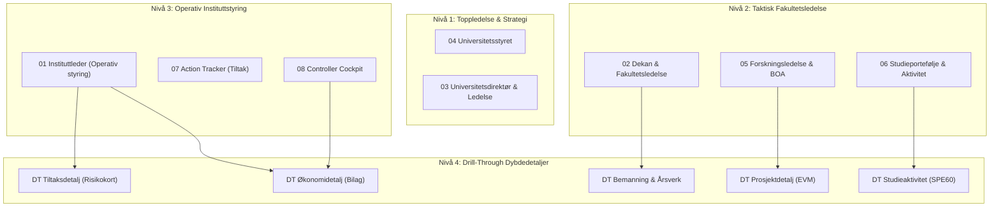
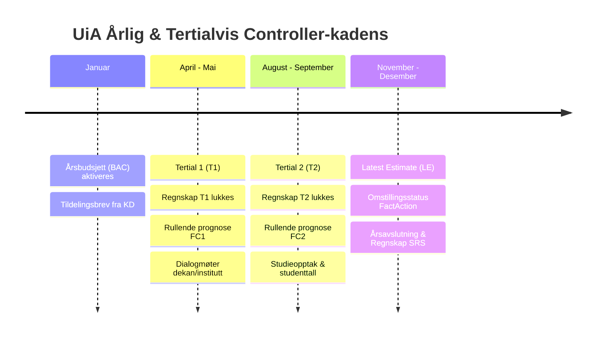

# UiA Controller - Helhetlig Virksomhetsstyring & Forecast Datamodell (Power BI / PBIP)

[](https://powerbi.microsoft.com/)
[](https://learn.microsoft.com/power-bi/developer/projects/projects-overview)
[](https://dfo.no/)
[](https://www.edwardtufte.com/)
[](scripts/test_dax_measures.py)
[](index.html)

Dette prosjektet representerer en **produksjonsklar virksomhetsstyrings- og prosjektcontroller-løsning** for **Universitetet i Agder (UiA)**. Løsningen er bygget fra grunnen av på **Microsoft Fabric / Power BI Project-formatet (`.pbip` med TMDL)**, og integrerer regnskap (DFØ SRS), periodiserte budsjetter, rullende tertialprognoser (EAC/ETC), omstillingstiltak (gevinstrealisering), bemanningsutvikling (årsverk) og student- og studieproduksjon (SPE60).

Rapporteringssuiten består av **13 spesialtilpassede dashboards** (8 rollebaserte styringspaneler og 5 drill-through dybdeanalyser) utformet strengt etter **Edward Tuftes prinsipper for Data-Ink Ratio**.

Et interaktivt visuelt overblikk over alle 13 rapporter og dashboards er tilgjengelig i webportalen:  
👉 [**Åpne Web Dashboard Portalen (`index.html`)**](index.html)

---

## Innholdsfortegnelse
1. [Forretningsmessig Kontekst & Formål](#1-forretningsmessig-kontekst--formål)
2. [Mappestruktur & Prosjektorganisering](#2-mappestruktur--prosjektorganisering)
3. [Datamodellens Arkitektur & Stjerneskjema](#3-datamodellens-arkitektur--stjerneskjema)
4. [DAX-målkatalog & Beregningslogikk](#4-dax-målkatalog--beregningslogikk)
5. [Komplett Rapportsuite (13 Dashboards)](#5-komplett-rapportsuite-13-dashboards)
6. [Edward Tufte Visualiseringsstandarder](#6-edward-tufte-visualiseringsstandarder)
7. [Controller-metodikk & Styringshjul](#7-controller-metodikk--styringshjul)
8. [Kvalitetssikring & Avstemmingstabell](#8-kvalitetssikring--avstemmingstabell)
9. [Installasjon & Utviklerveiledning](#9-installasjon--utviklerveiledning)

---

## 1. Forretningsmessig Kontekst & Formål

Universitets- og høyskolesektoren (UH-sektoren) er gjenstand for betydelige strukturelle endringer:
* **Bevilgningsmodell under press**: Kunnskapsdepartementets (KD) finansieringssystem kombinerer en fast grunnbevilgning med resultatbasert uttelling for studiepoengproduksjon (SPE60/kandidater) og ekstern forskningsfinansiering (BOA).
* **Demografiske endringer & omstilling**: Lavere studentkull fordrer streng dimensjonering av studieporteføljen, optimalisering av bemanningsforhold (studenter per vitenskapelig årsverk) og stram kostnadskontroll.
* **Statlige Regnskapsstandarder (DFØ SRS)**: UiA fører regnskap etter SRS (opptjeningsprinsippet), hvor inntekter fra bevilgning periodiseres i takt med påløpte kostnader, mens BOA-prosjekter inntektsføres etter fullført kontrakt eller påløpt fremdrift.

### Formål med Controller-modellen:
1. **Helhetlig styringsinformasjon i sanntid**: Koble finansielle regnskapstall sammen med ikke-finansielle styringsparametere (årsverk, studenttall, studiepoeng, gjennomføringsgrad).
2. **Beslutningsstøtte fra bunn til topp**: Tilby instituttledere, dekaner, universitetsdirektør og universitetsstyret skreddersydde dashboards tilpasset deres faktiske handlingsrom.
3. **Proaktiv prognostisering (EAC/ETC)**: Erstatte passive regnskapsrapporter med rullende estimater (`LE - Latest Estimate`), avviksdrivere og tiltaksoppfølging (`FactAction`).
4. **Prosjektcontrolling for BOA-porteføljen**: Full kontroll på NFR-, EU- og oppdragsforskning med Earned Value Management (BAC, EAC, ETC, VAC) og dekningsgrad for indirekte kostnader (TDI/overhead).

---

## 2. Mappestruktur & Prosjektorganisering

```text
uia_powerbi_complete_forecast_model/
├── data/                               # Kildata (UTF-8, semikolon-separerte CSV-filer)
│   ├── DimAccount.csv                  # Kontoplan iht. DFØ R-102/2025 (46 kontoer)
│   ├── DimDate.csv                     # Kalender 2026-2027 (730 dager)
│   ├── DimForecastVersion.csv          # Prognoseversjoner: BUD2026, FC1, FC2, LE (4 rader)
│   ├── DimOrganization.csv             # Organisasjonsstruktur for hele UiA (74 koststeder)
│   ├── DimPositionGroup.csv            # Stillingsgrupper: vitenskapelig/administrativ (5 rader)
│   ├── DimProject.csv                  # Prosjekter, BOA-typer og finansieringskilder (8 rader)
│   ├── DimStudyProgram.csv             # Studieprogrammer og studienivåer (22 rader)
│   ├── FactAction.csv                  # Omstillingstiltak og gevinstrealisering (16 tiltak)
│   ├── FactBudget.csv                  # Periodisert månedsbudsjett (17 760 rader)
│   ├── FactFTE.csv                     # Årsverk og faglige årsverk (1 440 rader)
│   ├── FactForecast.csv                # Rullende prognoser FC1, FC2, LE (53 280 rader)
│   ├── FactGL.csv                      # Hovedboksposteringer og regnskap (35 760 rader)
│   ├── FactStudyPoints.csv             # Studenttall og studiepoengproduksjon (264 rader)
│   └── Relationships.csv               # Definisjon av 22 relasjoner i stjernemodellen
├── dax/                                # DAX-katalog og formeldefinisjoner
│   ├── Complete_Measures.dax           # Komplett master DAX-katalog med kommentarer
│   └── All_Measures_Combined.dax       # Formaterte DAX-mål for Excel og DAX Studio
├── docs/                               # Dokumentasjon og faglige spesifikasjoner
│   ├── Controller - UIA.pdf            # Stillings- og casebeskrivelse for UiA Controller
│   ├── DATA_MODEL_ARCHITECTURE.md      # Detaljert datamodell, tabellkorn og relasjonsdefinisjoner
│   ├── Forecast_Model_Setup.md         # Regler for prognose- og versjonsmodellering
│   ├── PowerBI_Model_Setup.md          # Tekniske oppsettregler og hierarkier
│   ├── UIA_Controller_Reporting_Suite.md # Funksjonell rapportspesifikasjon
│   └── skills.md                       # Controller-profil og kompetansekart
├── excel/                              # Excel-arbeidsbøker og analyser
│   ├── uia_controller_excel_pack.xlsx  # Fullskala integrert controllermal (2.47 MB)
│   └── UIA-Controller-Rapport.xlsx     # Oppsummeringsark for ledelsen
├── scripts/                            # Automatiserings- og kvalitetssikringsskript
│   ├── build_tmdl_model.py             # Genererer TMDL semantisk modell for Power BI Developer Mode
│   ├── build_report_suite.py           # Genererer alle 13 dashboards i PBIR-format
│   ├── validate_model.py               # Verifiserer referanseintegritet og nøkler i DuckDB
│   └── test_dax_measures.py            # Kjører 43 automatiserte tester for DAX-beregninger
├── UIA-Controller-Prosjekt.pbip        # Power BI Project fil (åpnes i Desktop)
├── UIA-Controller-Prosjekt.Report/     # Visuell rapportdefinisjon (PBIR v2.1)
├── UIA-Controller-Prosjekt.SemanticModel/ # Semantisk modell i TMDL-format
├── index.html                          # Interaktiv webportal for alle 13 dashboards
├── PBI_Layout.txt                      # Komplett spesifikasjon av styringsstrukturen
└── README.md                           # Denne veiledningen
```

---

## 3. Datamodellens Arkitektur & Stjerneskjema

Modellen er konstruert som et **flerfakta stjerneskjema (Fact Constellation)** med 7 dimensjoner og 6 faktatabeller, bundet sammen av **22 en-til-mange (1:*) enveisrelasjoner**. 

```mermaid
erDiagram
    DimDate ||--o{ FactGL : "DatoNokkel"
    DimDate ||--o{ FactBudget : "DatoNokkel"
    DimDate ||--o{ FactForecast : "DatoNokkel"
    DimDate ||--o{ FactFTE : "DatoNokkel"
    DimDate ||--o{ FactStudyPoints : "DatoNokkel"
    DimDate ||--o{ FactAction : "FristDatoNokkel"

    DimOrganization ||--o{ FactGL : "Organisasjonsnokkel"
    DimOrganization ||--o{ FactBudget : "Organisasjonsnokkel"
    DimOrganization ||--o{ FactForecast : "Organisasjonsnokkel"
    DimOrganization ||--o{ FactFTE : "Organisasjonsnokkel"
    DimOrganization ||--o{ FactStudyPoints : "Organisasjonsnokkel"
    DimOrganization ||--o{ FactAction : "Organisasjonsnokkel"

    DimAccount ||--o{ FactGL : "Konto"
    DimAccount ||--o{ FactBudget : "Konto"
    DimAccount ||--o{ FactForecast : "Konto"
    DimAccount ||--o{ FactAction : "Konto"

    DimProject ||--o{ FactGL : "Prosjekt"
    DimProject ||--o{ FactBudget : "Prosjekt"
    DimProject ||--o{ FactForecast : "Prosjekt"
    DimProject ||--o{ FactAction : "Prosjekt"

    DimForecastVersion ||--o{ FactForecast : "Versjon"
    DimPositionGroup ||--o{ FactFTE : "Stillingsgruppe"
    DimStudyProgram ||--o{ FactStudyPoints : "Studieprogram"
```



### 3.1 Tabelloversikt & Korn (Granularitet)

| Tabellnavn | Type | Rader | Korn (Granularitet) | Primærnøkkel / Nøkkelfelt | Formål & Beskrivelse |
|---|---|---|---|---|---|
| **`DimDate`** | Dimensjon | 730 | Dagsnivå (2026-01-01 til 2027-12-31) | `DatoNokkel` (`YYYYMMDD`) | Felles tidskalender med måned-, kvartal- og årsattributter. |
| **`DimOrganization`** | Dimensjon | 74 | Koststedsnivå (UiA-struktur) | `Organisasjonsnokkel` | Organisasjonshierarki: Fakultet → Institutt → Koststed. |
| **`DimAccount`** | Dimensjon | 46 | Kontonivå (DFØ SRS R-102/2025) | `Konto` (heltall) | Statlig kontoplan med SRS-regnskapslinjer og kontotyper. |
| **`DimProject`** | Dimensjon | 8 | Prosjektkode | `Prosjekt` | Prosjekthierarki for grunnbevilgning og BOA (NFR, EU, Oppdrag). |
| **`DimForecastVersion`** | Dimensjon | 4 | Versjonsnivå | `Versjon` | Prognoserunder: `BUD2026`, `FC1_2026`, `FC2_2026`, `LE_2026`. |
| **`DimPositionGroup`** | Dimensjon | 5 | Stillingsgruppe | `Stillingsgruppe` | Vitenskapelige (UF) vs. teknisk-administrative (TA) stillinger. |
| **`DimStudyProgram`** | Dimensjon | 22 | Studieprogramkode | `Studieprogram` | Studieprogrammer på Bachelor-, Master- og PhD-nivå. |
| **`FactGL`** | Fakta | 35 760 | Bilagsrad per dato, org, konto, prosjekt | Bilags-ID | Bokført faktisk regnskap med `Belop_signert` (+ kostnad / - inntekt). |
| **`FactBudget`** | Fakta | 17 760 | Måned, org, konto, prosjekt | Sammensatt nøkkel | Vedtatt årsbudsjett 2026 periodisert per måned (`BudsjettBelop`). |
| **`FactForecast`** | Fakta | 53 280 | Måned, org, konto, prosjekt, versjon | Sammensatt nøkkel | Rullende prognoser med sannsynlighetsvekting (`Sannsynlighet`). |
| **`FactAction`** | Fakta | 16 | Tiltaks-ID per org, konto, prosjekt, frist | `TiltakID` | Omstillingstiltak med forventet og realisert innsparingseffekt. |
| **`FactFTE`** | Fakta | 1 440 | Måned, org, stillingsgruppe | Sammensatt nøkkel | Månedlig registrering av totalårsverk og faglige/vitenskapelige årsverk. |
| **`FactStudyPoints`** | Fakta | 264 | Måned, org, studieprogram | Sammensatt nøkkel | Registrerte studenter, planlagte og avlagte SP, samt SPE60-enheter. |

---

## 4. DAX-målkatalog & Beregningslogikk

Modellens over 60 DAX-mål er samlet i tabellen `_Measures` og strukturert i **8 display folders** iht. controller-faglige standarder:

### Mappeoversikt & Nøkkelmål

```text
_Measures/
├── 01 Okonomi/                   # Faktisk regnskap, budsjett, YTD og fortegnslogikk
├── 02 Budsjettering/             # Årsbudsjett (BAC) og periodiserte rammer
├── 03 Prognose (Forecast LE)/    # Rullende estimater (FC1, FC2, LE) og EAC
├── 04 Avvik & Varians/           # YTD-avvik, forecastavvik og avvik %
├── 05 Bemanning/                 # Årsverk (snapshot), faglige årsverk og lønn per årsverk
├── 06 Studieaktivitet/           # Studenter, studiepoeng, SPE60, enhetskostnader
├── 07 Prosjekt EVM/              # Earned Value: BAC, EAC, ETC, VAC og VAC %
└── 08 Tiltak & Risiko/           # Tiltaksoppfølging, realiseringsgrad og restavvik
```

### Utvalgte DAX-formler & Forretningsregler

#### 1. Regnskap & Inntektsfortegn (SRS-justert)
```dax
Regnskap = SUM ( FactGL[Belop_signert] )

Inntekter = 
CALCULATE (
    -[Regnskap],
    DimAccount[Kontotype] = "Inntekt"
)
-- Kommentar: Kreditposter snus til positivt fortegn for controller-rapportering
```

#### 2. Rullende Prognose (EAC - Estimate at Completion)
```dax
Gjeldende forecast = 
VAR V = SELECTEDVALUE ( DimForecastVersion[Versjon], "LE_2026" )
RETURN
    CALCULATE (
        SUM ( FactForecast[ForecastBelop] ),
        KEEPFILTERS ( DimForecastVersion[Versjon] = V )
    )

Forecast aarsbelop = 
CALCULATE ( [Gjeldende forecast], REMOVEFILTERS ( DimDate ) )

Forecastavvik = [Forecast aarsbelop] - [Aarsbudsjett]
```

#### 3. Bemannings-snapshot (Månedlig stabil status)
```dax
Aarsverk = 
VAR SisteDato =
    MAXX (
        FILTER ( ALLSELECTED ( DimDate ), CALCULATE ( COUNTROWS ( FactFTE ) ) > 0 ),
        DimDate[DatoNokkel]
    )
RETURN
    CALCULATE ( SUM ( FactFTE[Aarsverk] ), DimDate[DatoNokkel] = SisteDato )
```

#### 4. Earned Value Management (EVM for BOA-prosjekter)
```dax
BAC (Budget at Completion) = [Aarsbudsjett]
EAC (Estimate at Completion) = [Forecast aarsbelop]
ETC (Estimate to Complete) = [Forecast aarsbelop] - TOTALYTD ( [Gjeldende forecast], DimDate[Dato] )
VAC (Variance at Completion) = [BAC (Budget at Completion)] - [EAC (Estimate at Completion)]
VAC % = DIVIDE ( [VAC (Variance at Completion)], [BAC (Budget at Completion)] )
```

#### 5. Omstillings- og Tiltakseffekt (Netto Prognose)
```dax
Forecast etter tiltak = [Forecast aarsbelop] + [Forventet tiltakseffekt]
Restavvik etter tiltak = [Forecast etter tiltak] - [Aarsbudsjett]
Tiltaksdekning av avvik % = DIVIDE ( ABS ( [Forventet tiltakseffekt] ), ABS ( [Forecastavvik] ) )
```

---

## 5. Komplett Rapportsuite (13 Dashboards)

Rapporten er konfigurert med **13 dedikerte sider** i Power BI Enhanced Report Format (PBIR). Hver side svarer på spesifikke styringsspørsmål for definerte målgrupper:



### Detaljert Dashboard-gjennomgang

#### 1. `01 Instituttleder (Operativ styring)` (`page_01_instituttleder`)
* **Målgruppe**: Instituttledere og kontorsjefer.
* **Hovedspørsmål**: *Hva er instituttets økonomiske stilling i dag, hva driver prognoseavviket, og hvilke tiltak har vi iverksatt?*
* **KPI-stripe**: Regnskap YTD (10,62M) | Avvik YTD (-0,13M) | Forecast årsbeløp (36,79M) | Forecastavvik (+26,05M) | Årsverk (1 285,93).
* **Visuelle elementer**:
  * *Månedlig trend (Line Chart)*: Faktisk regnskap, budsjett og gjeldende forecast over 12 måneder.
  * *Avviksdrivere (Bar Chart)*: Forecastavvik fordelt på SRS-regnskapslinjer (Lønn, Drift, Avskrivninger).
  * *Ressurs- og produktivitetstabell*: Studenter, faglige årsverk, studenter per faglig årsverk, SPE60 og enhetskostnad.
  * *Tiltaksstatus*: Tabell over instituttets aktive omstillingstiltak.
  * *Bunnkort-oppsummering*: 1. Forecast før tiltak (36,79M) → 2. Tiltakseffekt (-10,01M) → 3. Forecast etter tiltak (26,79M) → 4. Restavvik (16,04M).

#### 2. `02 Dekan & Fakultetsledelse` (`page_02_dekan`)
* **Målgruppe**: Dekan, prodekaner og fakultetsdirektør.
* **Hovedspørsmål**: *Hvordan presterer instituttene relativt til hverandre, og har fakultetet tilstrekkelig omstillingskraft?*
* **KPI-stripe**: Forecast helår | Forecastavvik | Årsverk totalt | Registrerte studenter | BOA-inntekter | Forventet tiltakseffekt.
* **Visuelle elementer**:
  * *Instituttenes prognoseavvik (Bar Chart)*: Sammenlignende avviksvurdering på tvers av institutter.
  * *Eksternfinansiering per kilde (Bar Chart)*: Fordeling mellom NFR, EU og oppdragsinntekter.
  * *Faglig produktivitetstabell*: Kostnad per SPE60, studenter per faglig årsverk, SPE60 per faglig årsverk og lønnsandel %.
  * *Tiltaksoversikt per institutt*: Antall tiltak, åpne, forsinkede, samt realiseringsgrad %.

#### 3. `03 Universitetsdirektør & Ledelse` (`page_03_executive`)
* **Målgruppe**: Universitetsdirektør, økonomidirektør og rektorat.
* **Hovedspørsmål**: *Hvordan utvikler UiAs samlede rammer seg gjennom prognoserundene, og hvilke fakulteter bærer størst risiko?*
* **KPI-stripe**: Årsbudsjett UiA (10,75M) | Helårsprognose LE (36,79M) | Prognoseavvik (+26,05M) | Årsverk totalt (1 285,93) | BOA-finansieringsandel (1,20%).
* **Visuelle elementer**:
  * *Prognoseutvikling over runder (Line Chart)*: Historisk vandring fra Årsbudsjett → FC1 → FC2 → Latest Estimate.
  * *Prognoseavvik per fakultet (Bar Chart)*: Fakultetsvis fordeling av mer-/mindreforbruk.
  * *Hovedtall per fakultet (Matrise)*: Budsjett, Regnskap YTD, Forecast, Avvik, Årsverk og BOA.
  * *Omstillingsstatus & Netto resultat*: Full oversikt over tiltakseffekt og restavvik per fakultet.

#### 4. `04 Universitetsstyret` (`page_04_styret`)
* **Målgruppe**: Universitetsstyret.
* **Hovedspørsmål**: *Når UiA sine strategiske måltall innen utdanning og forskning, og er økonomisk bærekraft sikret?*
* **KPI-stripe**: Totalbudsjett | Forventet årsresultat | Forventet avvik % | Studiepoeng måloppnåelse % | Eksternfinansiering (BOA).
* **Visuelle elementer**:
  * *Strategisk måloppnåelse studieaktivitet*: Registrerte studenter (6 490), avlagte SP (336 945), SPE60 (5 615,74) og måloppnåelse (86,38%).
  * *Økonomisk risikobilde og omstilling*: Samlet vurdering av prognoseavvik mot innmeldte omstillingstiltak.
  * *Universitetsstyrets omstillingstiltak (Tabell)*: Detaljert oppfølging av de 16 styrebehandlede tiltakene.

#### 5. `05 Forskningsledelse & BOA` (`page_05_forskning_boa`)
* **Målgruppe**: Prorektor forskning, forskningsutvalg og forskningsrådgivere.
* **Hovedspørsmål**: *Hvor stor er eksternfinansieringen, hvordan fordeler den seg på kilder, og hva er BOA-uttellingen per faglig årsverk?*
* **KPI-stripe**: Total BOA-inntekt (25,68M) | NFR-inntekter (12,90M) | EU-inntekter (7,43M) | BOA per faglig årsverk (38 802 kr).
* **Visuelle elementer**:
  * *Finansieringskilder (Bar Chart)*: NFR, EU, Oppdrag og Ekstern.
  * *Finansieringstype (Bar Chart)*: Fordeling mellom bidragsforskning og oppdragsforskning.
  * *Fullstendig prosjektportefølje (Tabell)*: 8 prosjekter med regnskap, budsjett, forecast og avvik.

#### 6. `06 Studieportefølje & Aktivitet` (`page_06_studieportefolje`)
* **Målgruppe**: Prorektor utdanning, studiedirektør og programledere.
* **Hovedspørsmål**: *Hva er produksjonen per studieprogram, hvilke programmer svikter i måloppnåelse, og hva er enhetskostnaden per student?*
* **KPI-stripe**: Registrerte studenter (6 490) | Avlagte studiepoeng (336 945) | SPE60 (5 615,74) | Måloppnåelse (86,38%) | Kostnad per student | Kostnad per SPE60.
* **Visuelle elementer**:
  * *Enhetskostnad per SPE60 per institutt (Bar Chart)*: Viser kostnadseffektiviteten i utdanningen per enhet.
  * *SPE60 per studienivå (Bar Chart)*: Fordeling Bachelor, Master og PhD.
  * *Studieprogramaktivitet (Tabell)*: 22 programmer med studenttall, planlagte SP, avlagte SP og produksjonsgrad.

#### 7. `07 Action Tracker (Tiltak)` (`page_07_action_tracker`)
* **Målgruppe**: Omstillingsutvalg, prosjektledere og linjeledere.
* **Hovedspørsmål**: *Hvor stor andel av innsparingene er realisert, hvilke tiltak er forsinket, og hvem er ansvarlig?*
* **KPI-stripe**: Totalt antall tiltak (16) | Aktive åpne tiltak (12) | Forsinkede tiltak (4) | Forventet effekt (-10,01M) | Realisert effekt (-5,56M) | Realiseringsgrad (55,59%).
* **Visuelle elementer**:
  * *Tiltakseffekt per ansvarlig lederrolle (Bar Chart)*: Instituttleder, Dekan, HR-direktør, Eiendomsdirektør.
  * *Tiltakseffekt per status (Bar Chart)*: Gjennomført, Pågår, Forsinket.
  * *Komplett omstillingslogg (Tabell)*: Tiltaks-ID, avviksårsak, frister, forventet og realisert beløp, prioritet og status.

#### 8. `08 Controller Cockpit` (`page_08_controller_cockpit`)
* **Målgruppe**: Senior controllere og økonomisjef.
* **Hovedspørsmål**: *Hvor er de største bokførte feilene, avvikene og ubalansene i kontoplanen før månedsslutt?*
* **KPI-stripe**: Helårsavvik mot budsjett | Avvik i prosent | Forecast confidence % | Aktive tiltak | Gjenstående restavvik.
* **Visuelle elementer**:
  * *Avviksdrivere på kontonavn (Bar Chart)*: De 10 største avvikskontoene i hovedboken.
  * *Akkumulert YTD-utvikling (Line Chart)*: Regnskap YTD vs. Budsjett YTD over kalenderåret.
  * *Hierarkisk avstemmingsmatrise*: Full drilldown: Fakultet → Institutt → SRS-regnskapslinje → Konto.

#### 9–13. Drill-Through Dybdeanalyser
* **`page_dt_okonomi` (DT Økonomidetalj)**: Komplett bilagslogg fra `FactGL` (35 760 transaksjoner) med bilagsnummer, tekst, kontonummer og signert beløp.
* **`page_dt_bemanning` (DT Bemanning & Årsverk)**: Stillingskategorier og stillingsgrupper fra `FactFTE` og `DimPositionGroup`, lønnskostnader og lønn per årsverk.
* **`page_dt_prosjekt` (DT Prosjektdetalj - EVM)**: Prosjektkort med Earned Value Management-mål (BAC, EAC, ETC, VAC, VAC %).
* **`page_dt_tiltak` (DT Tiltaksdetalj - Risikokort)**: Enkeltkort for hvert omstillingstiltak med årsaksanalyse, risikovurdering (sannsynlighet/konsekvens) og milepælsdatoer.
* **`page_dt_studier` (DT Studieaktivitet)**: Detaljert produksjon per studieprogram med beståttandel og SPE60-beregninger fra `FactStudyPoints`.

---

## 6. Edward Tufte Visualiseringsstandarder

I tråd med **Edward Tuftes prinsipper for Data-Ink Ratio** er rapportene renset for all visuell støy for å maksimere informasjonsverdien:

| Tufte-prinsipp | Implementering i UiA Controller-modellen | Hvorfor dette er overlegent for ledelsen |
|---|---|---|
| **Fjern unødvendig blekk (Chartjunk)** | Ingen 3D-grafer, ingen tunge skygger (drop shadows), ingen dekorative ikoner eller fargebannere. | Reduserer kognitiv belastning og holder fokus på tallene og årsakene. |
| **Tabeller uten vertikale streker** | Ingen vertikale linjer mellom kolonner. Kun diskrete horisontale linjer for rader og totalsummer. | Tabeller blir vesentlig lettere å skanne horisontalt langs regnskapslinjene. |
| **Typografi & Justering** | Tekst er **venstrejustert**, alle tall og valutaer er **høyrejustert** med tabellære tall og faste desimaler. | Sikrer at sifre og tierpotenser flukter loddrett, slik at størrelsesforhold oppfattes umiddelbart. |
| **Direkte merking (Direct Labeling)** | Kurver og stolpediagrammer har direkte tekst på dataserien fremfor store, separate fargeforklaringer (legends). | Øyet slipper å vandre fram og tilbake mellom graf og tegnforklaring. |
| **Funksjonell fargebruk (Muted Palette)** | Nøytrale gråtoner og mørkeblå baser for faste data. Aksentfarger benyttes **kun** for aktive avvik og risiko: <br>• Rød (`#C00000` / `#EF4444`): Avvik > 5 % eller forsinket tiltak.<br>• Gul (`#FFC000` / `#F59E0B`): Avvik 2–5 % eller moderat risiko.<br>• Grønn (`#70AD47` / `#10B981`): Innenfor terskel eller realisert mål. | Unngår "juletre-effekt". Farge betyr umiddelbar oppmerksomhet og handling. |

---

## 7. Controller-metodikk & Styringshjul

Løsningen speiler UiAs faktiske økonomiske styringshjul og rapporteringskadens:



### Hovedprosesser
1. **Månedlig avstemming**: Faktiske poster fra regnskapssystemet (`FactGL`) leses inn mot periodisert budsjett (`FactBudget`). Avvik over 500 000 NOK flagges automatisk i `08 Controller Cockpit`.
2. **Tertialvise dialogmøter**: Dekan og instituttleder benytter `01 Instituttleder` og `02 Dekan` for å drøfte ressursbruk, bemanningsbehov og tiltak.
3. **Omstillingsoppfølging (`FactAction`)**: Hvert tiltak eies av en navngitt lederrolle. Realisert gevinst måles kontinuerlig mot forventet effekt og motregnes i `Forecast etter tiltak`.
4. **Prosjektcontrolling**: BOA-prosjekter evalueres månedlig med Earned Value-metodikk. ETC (Estimate to Complete) oppdateres av prosjektcontroller for å avdekke overskridelser før prosjektslutt.

---

## 8. Kvalitetssikring & Avstemmingstabell

Modellens integritet og beregninger er automatisk verifisert gjennom QA-testsuiten ([`scripts/validate_model.py`](scripts/validate_model.py) og [`scripts/test_dax_measures.py`](scripts/test_dax_measures.py)) mot en lokal DuckDB analysemotor.

### Verifiserte Hovedtall (Benchmark)

| Fagområde | Modellens Nøkkeltall | Måltall / Beløp | Verifisering & Integritet |
|---|---|---|---|
| **Faktisk Regnskap (`FactGL`)** | Totale bokførte inntekter | 2 138 486 811,09 NOK | 35 760 transaksjoner, 0 orfe |
| | Totale driftskostnader | 2 149 103 939,28 NOK | Sum lønn, drift og avskrivninger |
| | **Netto regnskapsresultat** | **10 617 128,19 NOK** | Netto driftsunderskudd / rammetrekk |
| | Lønnskostnader | 1 482 268 875,90 NOK | 68,97 % lønnsandel |
| **Budsjett (`FactBudget`)** | Netto budsjett (BAC) | 10 747 732,82 NOK | 17 760 periodiserte linjer |
| | Budsjettavvik YTD | -130 604,63 NOK | -1,22 % (mindreforbruk hittil) |
| **Prognoser (`FactForecast`)** | Prognose T1 (FC1_2026) | 35 472 635,98 NOK | 53 280 prognoselinjer |
| | Prognose T2 (FC2_2026) | 35 956 159,17 NOK | Rullende oppdatering |
| | **Gjeldende helårsprognose (LE)** | **36 793 524,31 NOK** | **EAC (Estimate at Completion)** |
| | **Forecastavvik mot budsjett** | **+26 045 791,49 NOK** | Forventet merforbruk før tiltak |
| **Omstilling (`FactAction`)** | Tiltaksportefølje | 16 tiltak | 12 aktive, 4 forsinkede |
| | Forventet tiltakseffekt | -10 005 000,00 NOK | Fullt innsparingspotensial |
| | Realisert tiltakseffekt | -5 562 081,66 NOK | 55,59 % realiseringsgrad |
| | **Netto prognose etter tiltak** | **26 788 524,31 NOK** | Gjenstående restavvik: 16 040 791,49 NOK |
| **BOA Prosjekter (`DimProject`)** | Samlede BOA-inntekter | 25 678 288,24 NOK | NFR (12,90M), EU (7,43M), Ekstern (5,35M) |
| | BOA-andel av inntekter | 1,20 % | Eksternfinansieringsgrad |
| **Bemanning (`FactFTE`)** | Årsverk siste måned | 1 285,93 årsverk | 1 440 rader, 0 duplikater |
| | Faglige/vitenskapelige årsverk | 661,77 årsverk | 51,46 % vitenskapelig andel |
| **Utdanning (`FactStudyPoints`)** | Registrerte studenter | 6 490 studenter | Siste måneds snapshot |
| | Avlagte studiepoeng | 336 945,40 SP | 86,38 % måloppnåelse mot plan |
| | SPE60 helårsekvivalenter | 5 615,74 SPE | 9,8 studenter per faglig årsverk |

### Kjøring av automatiserte tester

```powershell
# 1. Validering av referanseintegritet, tabellformater og 0 duplikater:
python scripts/validate_model.py

# 2. Kjøring av 43 automatiserte DAX- og forretningslogikktester:
python scripts/test_dax_measures.py
```

Resultat: **43/43 tester bestått (0 feil)**.

---

## 9. Installasjon & Utviklerveiledning

### Forutsetninger
* **Power BI Desktop** (August 2024 eller nyere, med *Power BI Project (.pbip)* aktivert under forhåndsvisningsfunksjoner).
* **Python 3.10+** (med `duckdb` installert for testing).
* **VS Code** med *TMDL* og *Fabric* utvidelser (anbefalt for modellredigering).

### 1. Åpne prosjektet i Power BI Desktop
1. Klon eller last ned repositoriet.
2. Dobbeltklikk på prosjektfilen [`UIA-Controller-Prosjekt.pbip`](UIA-Controller-Prosjekt.pbip).
3. Power BI Desktop leser automatisk `UIA-Controller-Prosjekt.SemanticModel` og `UIA-Controller-Prosjekt.Report`.
4. Ved første gangs åpning: Klikk **Oppdater** (**Refresh**) i båndet for å laste dataene inn i minnet.

### 2. Viktig om regional kultur & desimalskilletegn (`sourceQueryCulture`)
Kildatasettene i `data/*.csv` benytter **semikolon (`;`) som skilletegn** og **punktum (`.`) som desimalskilletegn**. På maskiner med norsk Windows-oppsett vil Power BI som standard forvente komma som desimalskilletegn.
* Dette er fullt ivaretatt i modellen: `sourceQueryCulture: en-US` er definert i [`model.tmdl`](UIA-Controller-Prosjekt.SemanticModel/definition/model.tmdl), og alle 13 tabellpartisjoner eksplisitt angir `, "en-US"` i `Table.TransformColumnTypes`.
* Tallene parses derfor alltid korrekt uavhengig av maskinens operativsystemspråk.

### 3. Endre databane (Parameter)
Dersom prosjektet flyttes til en ny bane:
1. Klikk **Transformer data** -> **Rediger parametere** (**Edit Parameters**).
2. Angi den nye absolutte banen til mappen `data`.
3. Klikk **Bruk endringer**.

### 4. Regenerere eller oppdatere rapporter via skript
Hvis layout eller felter skal modifiseres programmatisk:
```powershell
# Regenerer semantisk modell i TMDL:
python scripts/build_tmdl_model.py

# Regenerer alle 13 rapportdashboards i PBIR:
python scripts/build_report_suite.py
```

---

## 10. Forfatter & Kontakt

**Frank Ellingsen**  
*Financial Controller / Business Intelligence Specialist / Project Controller*  
Spesialist innen virksomhetsstyring, rullende prognoser (EAC/ETC), statlige regnskapsstandarder (SRS) og Power BI / Fabric datamodellering.
