# UiA Controller Data Model Architecture & Governance (Full-Scale Package)

## 1. Executive Summary
Dette dokumentet beskriver den helhetlige arkitekturen, datagrunnlaget og modelleringsprinsippene for UiA Controller-modellen (`UIA-Controller-Prosjekt`). Modellen er implementert som et **stjerneskjema med flere faktatabeller (Fact Constellation)** i Microsoft Fabric / Power BI Project-formatet (`.pbip` / TMDL).

Modellen representerer en komplett virksomhets- og økonomimodell for Universitetet i Agder (UiA) i henhold til DFØs statlige regnskapsstandarder (SRS) og KDs bevilgnings- og BOA-retningslinjer:
*   **Finans (Hovedbok / SRS)**: Faktiske regnskapsposteringer på 46 DFØ-standardkontoer og KD/BOA-prosjekter (`FactGL`, 35 760 rader).
*   **Budsjett**: Årsbudsjett periodisert per måned, koststed, konto og prosjekt (`FactBudget`, 17 760 rader).
*   **Forecast (Prognoser)**: Rullende prognoseversjoner (`FC1_2026`, `FC2_2026`, `LE_2026`) med sannsynlighetsvekting (`FactForecast`, 53 280 rader).
*   **Tiltak & Omstilling**: Porteføljeoppfølging av innsparingstiltak og omstillingsinitiativer med tidsfrister, ansvarlige og realiserte effekter (`FactAction`, 16 rader).
*   **Bemanning (HR)**: Årsverk og faglige årsverk per stillingsgruppe og organisasjonsenhet (`FactFTE`, 1 440 rader).
*   **Aktivitet & Studieproduksjon**: Registrerte studenter, planlagte og avlagte studiepoeng samt SPE60-enheter per studieprogram (`FactStudyPoints`, 264 rader).

---

## 2. Dimensjonsmodell & Relasjoner (22 Relasjoner)

```mermaid
erDiagram
    DimDate ||--o{ FactGL : "DatoNokkel"
    DimDate ||--o{ FactBudget : "DatoNokkel"
    DimDate ||--o{ FactForecast : "DatoNokkel"
    DimDate ||--o{ FactFTE : "DatoNokkel"
    DimDate ||--o{ FactStudyPoints : "DatoNokkel"
    DimDate ||--o{ FactAction : "FristDatoNokkel"

    DimOrganization ||--o{ FactGL : "Organisasjonsnokkel"
    DimOrganization ||--o{ FactBudget : "Organisasjonsnokkel"
    DimOrganization ||--o{ FactForecast : "Organisasjonsnokkel"
    DimOrganization ||--o{ FactFTE : "Organisasjonsnokkel"
    DimOrganization ||--o{ FactStudyPoints : "Organisasjonsnokkel"
    DimOrganization ||--o{ FactAction : "Organisasjonsnokkel"

    DimAccount ||--o{ FactGL : "Konto"
    DimAccount ||--o{ FactBudget : "Konto"
    DimAccount ||--o{ FactForecast : "Konto"
    DimAccount ||--o{ FactAction : "Konto"

    DimProject ||--o{ FactGL : "Prosjekt"
    DimProject ||--o{ FactBudget : "Prosjekt"
    DimProject ||--o{ FactForecast : "Prosjekt"
    DimProject ||--o{ FactAction : "Prosjekt"

    DimForecastVersion ||--o{ FactForecast : "Versjon"
    DimPositionGroup ||--o{ FactFTE : "Stillingsgruppe"
    DimStudyProgram ||--o{ FactStudyPoints : "Studieprogram"
```

### 2.1 Dimensjoner (1-siden)
1.  **`DimDate`** (730 rader: 2026-01-01 til 2027-12-31):
    *   **PK**: `DatoNokkel` (heltall `YYYYMMDD`).
    *   Attributter: `Dato`, `Aar`, `Kvartal`, `MaanedNr`, `Maaned`, `AarMaaned`, `MaanedStart`.
    *   Sortering: `Maaned` sortert etter `MaanedNr`.
2.  **`DimOrganization`** (74 rader):
    *   **PK**: `Organisasjonsnokkel` (tekstnøkkel, f.eks. `I001K1`, `I002K3`).
    *   Attributter: `Fakultet`, `Fakultetsnavn`, `Institutt`, `Instituttnavn`, `Koststed`, `Koststednavn`, `Koststedtype`, `Organisasjonsnivaa`.
    *   Hierarki: `Fakultetsnavn` > `Instituttnavn` > `Koststednavn`.
3.  **`DimAccount`** (46 rader, DFØ Standard Kontoplan R-102/2025):
    *   **PK**: `Konto` (heltall, f.eks. `3030`, `3900`, `5000`, `6000`).
    *   Attributter: `Kontonavn`, `Kontotype` (`Inntekt`, `Kostnad`), `SRS_regnskapslinje` (`Inntekt fra bevilgninger`, `Tilskudd og overforinger`, `Salgsinntekt`, `Andre driftsinntekter`, `Lonnskostnader`, `Andre driftskostnader`, `Av- og nedskrivninger`).
    *   Hierarki: `Kontohierarki` (`SRS_regnskapslinje` > `Kontotype` > `Kontonavn` > `Konto`).
4.  **`DimProject`** (8 rader):
    *   **PK**: `Prosjekt` (tekstkode, f.eks. `DRIFT`, `NFR001`, `EU001`, `OPP001`).
    *   Attributter: `Prosjektnavn`, `Finansieringstype` (`Bevilgning`, `Bidrag`, `Oppdrag`), `Finansieringskilde` (`KD`, `NFR`, `EU`, `Ekstern`), `Prosjektkategori`, `Startaar`, `Sluttaar`.
    *   Hierarki: `Prosjekthierarki` (`Finansieringstype` > `Finansieringskilde` > `Prosjektkategori` > `Prosjektnavn`).
5.  **`DimForecastVersion`** (4 rader):
    *   **PK**: `Versjon` (`BUD2026`, `FC1_2026`, `FC2_2026`, `LE_2026`).
    *   Attributter: `Versjonsnavn`, `Versjonstype`, `Sortering`, `CutoffDatoNokkel`, `ErGjeldende`.
6.  **`DimPositionGroup`** (5 rader):
    *   **PK**: `Stillingsgruppe` (`VIT_PROF`, `VIT_FORST`, `VIT_REKR`, `ADM_LEDER`, `ADM_SAKSB`).
    *   Attributter: `Stillingsgruppenavn`, `Stillingskategori` (`Vitenskapelig`, `Administrativ`).
7.  **`DimStudyProgram`** (22 rader):
    *   **PK**: `Studieprogram` (kode, f.eks. `BOKADM`, `MOKLED`).
    *   Attributter: `Studieprogramnavn`, `Studienivaa` (`Bachelor`, `Master`, `PhD`), `NormerteStudiepoeng`, `Institutt`, `OrgEnhet`, `Status`, `Rapporteringsaar`.

### 2.2 Faktatabeller (*-siden)
1.  **`FactGL`** (35 760 rader): Hovedbokstransaksjoner for hele UiA.
    *   Korn: Bilagsrad per dato, organisasjonsnøkkel, konto, prosjekt.
    *   Måltall: `Belop_signert` (inntekter med negativt fortegn, kostnader med positivt fortegn).
    *   Total volum: 2,138 mrd kr inntekter, 2,149 mrd kr kostnader, 10,62 mill kr netto.
2.  **`FactBudget`** (17 760 rader): Periodisert månedsbudsjett 2026.
    *   Korn: Måned (`DatoNokkel`), organisasjonsnøkkel, konto, prosjekt.
    *   Måltall: `BudsjettBelop`. Total netto: 10,75 mill kr.
3.  **`FactForecast`** (53 280 rader): Rullende prognosemodeller.
    *   Korn: Måned (`DatoNokkel`), organisasjonsnøkkel, konto, prosjekt, versjon.
    *   Måltall: `ForecastBelop`, `Sannsynlighet`.
    *   Versjoner: FC1 (35,47M), FC2 (35,96M), LE (36,79M).
4.  **`FactAction`** (16 rader): Tiltaks- og omstillingsoppfølging.
    *   Korn: Tiltak per tiltaks-ID, organisasjonsnøkkel, konto, prosjekt, fristdato.
    *   Attributter: `Tiltaksnavn`, `Beskrivelse`, `Ansvarlig`, `Status` (`Gjennomfort`, `Pagar`, `Forsinket`, `Planlagt`), `Tiltakskategori`.
    *   Måltall: `ForventetEffekt` (-10,01M), `RealisertEffekt` (-5,56M), `Realiseringsgrad` (55,6%).
5.  **`FactFTE`** (1 440 rader): Bemanningsutvikling.
    *   Korn: Måned (`DatoNokkel`), organisasjonsnøkkel, stillingsgruppe.
    *   Måltall: `Aarsverk` (1 285,93 siste mnd), `FagligeAarsverk` (661,77 siste mnd).
6.  **`FactStudyPoints`** (264 rader): Studieproduksjon.
    *   Korn: Måned (`DatoNokkel`), organisasjonsnøkkel, studieprogram.
    *   Måltall: `RegistrerteStudenter` (6 490 siste mnd), `PlanlagteStudiepoeng` (390 095), `AvlagteStudiepoeng` (336 945,4), `SPE60` (5 615,74).

---

## 3. Forretningslogikk & DAX-målekatalog

Alle måltall er sentralisert i `_Measures` og strukturert i 7 dedikerte visningsmapper:

| Mappe | Mål | Formel / Beskrivelse | Format |
|---|---|---|---|
| **01 Okonomi** | `Regnskap` | `SUM(FactGL[Belop_signert])` | `#,##0.00` |
| | `Budsjett` | `SUM(FactBudget[BudsjettBelop])` | `#,##0.00` |
| | `Avvik` | `[Regnskap] - [Budsjett]` | `#,##0.00` |
| | `Avvik %` | `DIVIDE([Avvik], ABS([Budsjett]))` | `0.0%` |
| | `Regnskap YTD` | `TOTALYTD([Regnskap], DimDate[Dato])` | `#,##0.00` |
| | `Budsjett YTD` | `TOTALYTD([Budsjett], DimDate[Dato])` | `#,##0.00` |
| | `Inntekter` | `CALCULATE(-[Regnskap], DimAccount[Kontotype] = "Inntekt")` | `#,##0.00` |
| | `Kostnader` | `CALCULATE([Regnskap], DimAccount[Kontotype] = "Kostnad")` | `#,##0.00` |
| | `Lonnskostnader` | `CALCULATE([Regnskap], DimAccount[SRS_regnskapslinje] = "Lonnskostnader")` | `#,##0.00` |
| | `Lonnandel %` | `DIVIDE([Lonnskostnader], [Kostnader])` (~69 %) | `0.0%` |
| **02 Forecast** | `Forecast` | `SUM(FactForecast[ForecastBelop])` | `#,##0.00` |
| | `Gjeldende forecast`| Filtrert på aktiv versjon (`LE_2026` standard) | `#,##0.00` |
| | `Aarsbudsjett` | `CALCULATE([Budsjett], REMOVEFILTERS(DimDate))` | `#,##0.00` |
| | `Forecast aarsbelop`| Helårsestimat for gjeldende forecastversjon | `#,##0.00` |
| | `Forecastavvik` | `[Forecast aarsbelop] - [Aarsbudsjett]` | `#,##0.00` |
| | `FC1 / FC2 / LE` | Isolerte helårsestimater per tertial | `#,##0.00` |
| | `Endring FC2 til LE`| `[Latest Estimate] - [FC2]` | `#,##0.00` |
| | `Forecast lonn` | Forecast for lønnskostnader | `#,##0.00` |
| **03 Bemanning & Studier** | `Aarsverk` | Siste måneds snapshot av totale årsverk (1 285,93) | `#,##0.00` |
| | `Faglige aarsverk` | Siste måneds vitenskapelige årsverk (661,77) | `#,##0.00` |
| | `Registrerte studenter`| Siste måneds studentantall (6 490) | `#,##0` |
| | `Avlagte studiepoeng`| `SUM(FactStudyPoints[AvlagteStudiepoeng])` | `#,##0.0` |
| | `SPE60` | `SUM(FactStudyPoints[SPE60])` | `#,##0.00` |
| | `SP maaloppnaelse %` | `Avlagte / Planlagte SP` (86,4 %) | `0.0%` |
| | `Studenter per faglig AV`| `[Registrerte studenter] / [Faglige aarsverk]` (9,8) | `#,##0.0` |
| | `Kostnad per student`| `[Kostnader] / [Registrerte studenter]` | `#,##0.00` |
| | `Kostnad per SPE60` | `[Kostnader] / [SPE60]` | `#,##0.00` |
| **04 BOA** | `BOA inntekter` | Eksterne inntekter (`Bidrag`, `Oppdrag`) (25,68M) | `#,##0.00` |
| | `NFR inntekter` | Prosjektinntekter fra Forskningsrådet (12,90M) | `#,##0.00` |
| | `EU inntekter` | Prosjektinntekter fra EU Horisont mfl. (7,43M) | `#,##0.00` |
| | `BOA andel %` | `[BOA inntekter] / [Inntekter]` (1,2 %) | `0.0%` |
| | `BOA per faglig AV` | `[BOA inntekter] / [Faglige aarsverk]` | `#,##0.00` |
| **05 Tiltak** | `Antall tiltak` | `DISTINCTCOUNT(FactAction[TiltakID])` (16) | `#,##0` |
| | `Forventet tiltakseffekt`| `SUM(FactAction[ForventetEffekt])` (-10,01M) | `#,##0.00` |
| | `Realisert tiltakseffekt`| `SUM(FactAction[RealisertEffekt])` (-5,56M) | `#,##0.00` |
| | `Tiltak realiseringsgrad %`| `[Realisert] / [Forventet]` (55,6 %) | `0.0%` |
| | `Aapne tiltak` | Antall med status ulik 'Gjennomfort' (12) | `#,##0` |
| | `Forsinkede tiltak` | Antall med status 'Forsinket' (4) | `#,##0` |
| | `Forecast etter tiltak` | `[Forecast aarsbelop] + [Forventet tiltakseffekt]` | `#,##0.00` |
| | `Restavvik etter tiltak`| `[Forecast etter tiltak] - [Aarsbudsjett]` | `#,##0.00` |
| **06 EVM Prosjekt** | `BAC` | Budget at Completion (`[Aarsbudsjett]`) | `#,##0.00` |
| | `EAC` | Estimate at Completion (`[Forecast aarsbelop]`) | `#,##0.00` |
| | `ETC` | Estimate to Complete (`EAC - Gjeldende YTD`) | `#,##0.00` |
| | `VAC` | Variance at Completion (`BAC - EAC`) | `#,##0.00` |
| | `VAC %` | `VAC / BAC` | `0.0%` |
| **07 Status & Farger**| `Forecaststatus` | `Rod` (>5% avvik), `Gul` (2-5%), `Gronn`, `Bla` | Tekst |
| | `Forecaststatus farge` | `#C00000`, `#FFC000`, `#70AD47`, `#5B9BD5` | Hex |

---

## 4. Edward Tufte Data-Ink Standarder

I overensstemmelse med Edward Tuftes visualiseringsteori og globale controller-retningslinjer:
1.  **Fjerning av Chart Junk**:
    *   Ingen vertikale tabellinjer eller unødvendige rutenett i tabeller og matriser.
    *   Ingen skygger (drop shadows), tunge rammer eller dekorative ikoner på KPI-kort.
    *   Direkte merking (direct labeling) på S-kurver og linjediagrammer i stedet for separate fargelagender.
2.  **Muted Palette & Signalfarger**:
    *   Nøytrale farger for basisvisning (`#333333`, `#666666`, `#F2F2F2`).
    *   Sterke farger forbeholdes aktive avvik: Rød (`#C00000`) for merforbruk/forsinkelser, Grønn (`#70AD47`) for gjennomføring, Gul (`#FFC000`) for observasjon.
3.  **Typografi & Justering**:
    *   Venstrejuster alltid tekstkolonner (fakultet, institutt, konto, prosjekt, tiltak).
    *   Høyrejuster alltid numeriske kolonner, valutaer og prosenter, med vertikal justering av desimaler.
