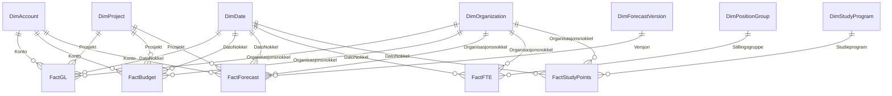

# UiA Controller Data Model Architecture & Governance

## 1. Executive Summary
Dette dokumentet beskriver arkitekturen, datagrunnlaget og modelleringsprinsippene for UiA Controller-modellen (`UIA-Controller-Prosjekt`). Modellen er implementert som et **stjerneskjema med flere faktatabeller (Fact Constellation)** i Microsoft Fabric / Power BI Project-formatet (`.pbip` / TMDL).

Den dekker full økonomi- og virksomhetsstyring for Universitetet i Agder (UiA):
*   **Finans (Hovedbok / SRS)**: Faktiske regnskapstransaksjoner (`FactGL`).
*   **Budsjett**: Årsbudsjett per måned, koststed, konto og prosjekt (`FactBudget`).
*   **Forecast (Prognose)**: Rullende prognoseversjoner (`FC1_2026`, `FC2_2026`, `LE_2026`) med tiltakseffekter og datakvalitetsvekting (`FactForecast`).
*   **Bemanning (HR)**: Årsverk og faglige årsverk per stillingsgruppe og organisasjonsenhet (`FactFTE`).
*   **Aktivitet & Studieproduksjon**: Registrerte studenter, planlagte og avlagte studiepoeng samt SPE60-enheter per studieprogram (`FactStudyPoints`).

---

## 2. Dimensjonsmodell & Granularitet (Grain)

### Dimensjoner (1-siden)
1.  **`DimDate`** (365 rader):
    *   **PK**: `DatoNokkel` (heltall `YYYYMMDD`).
    *   Attributter: `Dato`, `Aar`, `Kvartal`, `MaanedNr`, `Maaned`, `AarMaaned`, `MaanedStart`.
    *   Sortering: `Maaned` sortert etter `MaanedNr`.
2.  **`DimOrganization`** (63 rader):
    *   **PK**: `Organisasjonsnokkel` (heltall, f.eks. `100001`, `210100`).
    *   Attributter: `OrgEnhet`, `OrgNavn`, `Institutt`, `Instituttnavn`, `Koststed`, `Koststednavn`, `Koststedtype`, `Organisasjonsnivaa`.
    *   Merk: Finansfakta ligger på koststednivå (`Koststedtype = 'Drift'/'Prosjekt'`). Bemanning og studiepoeng allokeres på institutt-total (`Koststedtype = 'Institutt total'`).
3.  **`DimAccount`** (17 rader):
    *   **PK**: `Konto` (heltall, f.eks. `3000`, `5000`).
    *   Attributter: `Kontonavn`, `Kontotype` (`Inntekt`, `Kostnad`), `SRS_regnskapslinje`.
4.  **`DimProject`** (8 rader):
    *   **PK**: `Prosjekt` (tekstkode, f.eks. `DRIFT`, `NFR001`, `EU001`).
    *   Attributter: `Prosjektnavn`, `Finansieringstype` (`Bevilgning`, `Bidrag`, `Oppdrag`), `Finansieringskilde` (`KD`, `NFR`, `EU`, `Privat`), `Prosjektkategori`, `Startaar`, `Sluttaar`.
5.  **`DimForecastVersion`** (4 rader):
    *   **PK**: `Versjon` (`BUD2026`, `FC1_2026`, `FC2_2026`, `LE_2026`).
    *   Attributter: `Versjonsnavn`, `Versjonstype`, `Sortering`, `CutoffDatoNokkel`, `ErGjeldende`.
6.  **`DimPositionGroup`** (5 rader):
    *   **PK**: `Stillingsgruppe` (`VIT_PROF`, `VIT_FORST`, `VIT_REKR`, `ADM_LEDER`, `ADM_SAKSB`).
    *   Attributter: `Stillingsgruppenavn`, `Stillingskategori` (`Vitenskapelig`, `Administrativ`).
7.  **`DimStudyProgram`** (22 rader):
    *   **PK**: `Studieprogram` (kode, f.eks. `BOKADM`, `MOKLED`).
    *   Attributter: `Studieprogramnavn`, `Studienivaa` (`Bachelor`, `Master`, `PhD`), `NormerteStudiepoeng`, `Institutt`, `OrgEnhet`, `Status`, `Rapporteringsaar`.

### Faktatabeller (*-siden)
1.  **`FactGL`** (2 808 rader): Hovedbokstransaksjoner.
    *   Korn: Bilagsrad per transaksjonsdato, koststed, konto og prosjekt.
    *   Måltall: `Belop_signert` (inntekter negative, kostnader positive), `Debet`, `Kredit`.
2.  **`FactBudget`** (1 306 rader): Månedsbudsjett 2026.
    *   Korn: Måned (`DatoNokkel`), koststed, konto, prosjekt.
    *   Måltall: `BudsjettBelop`.
3.  **`FactForecast`** (3 918 rader): Rullende prognoser 2026.
    *   Korn: Måned (`DatoNokkel`), koststed, konto, prosjekt, versjon.
    *   Måltall: `ForecastBelop`, `Tiltakseffekt`, `Sannsynlighet`.
4.  **`FactFTE`** (1 260 rader): Månedlig bemanning.
    *   Korn: Måned (`DatoNokkel`), organisasjonsnøkkel, stillingsgruppe.
    *   Måltall: `Aarsverk`, `FagligeAarsverk`.
5.  **`FactStudyPoints`** (264 rader): Studiepoengproduksjon.
    *   Korn: Måned (`DatoNokkel`), organisasjonsnøkkel, studieprogram.
    *   Måltall: `RegistrerteStudenter`, `PlanlagteStudiepoeng`, `AvlagteStudiepoeng`, `SPE60`, `BestattAndel`.

---

## 3. Forhåndsdefinerte Hierarkier

1.  **UiA organisasjon** (`DimOrganization`):
    `OrgNavn` > `Instituttnavn` > `Koststednavn`
2.  **Konto** (`DimAccount`):
    `SRS_regnskapslinje` > `Kontotype` > `Kontonavn` > `Konto`
3.  **Prosjekt** (`DimProject`):
    `Finansieringstype` > `Finansieringskilde` > `Prosjektkategori` > `Prosjektnavn`
4.  **Studie** (`DimStudyProgram`):
    `Studienivaa` > `Studieprogramnavn`
5.  **Tid** (`DimDate`):
    `Aar` > `Kvartal` > `Maaned` > `Dato`

---

## 4. DAX-målekatalog & Forretningslogikk

Alle mål er plassert i en dedikert tabell `_Measures` og strukturert i 8 nummererte mapper:

| Mappe | Mål | Formel / Beskrivelse | Format |
|---|---|---|---|
| **01 Faktisk** | `Faktisk belop` | `SUM(FactGL[Belop_signert])` | `# ##0 kr` |
| | `Faktisk inntekter` | Snu fortegn for `DimAccount[Kontotype] = "Inntekt"` | `# ##0 kr` |
| | `Faktisk kostnader` | Filtrert på `DimAccount[Kontotype] = "Kostnad"` | `# ##0 kr` |
| | `Faktisk lonnskostnader` | Filtrert på SRS `Lonnskostnader` | `# ##0 kr` |
| | `Faktisk YTD` | `TOTALYTD([Faktisk belop], DimDate[Dato])` | `# ##0 kr` |
| **02 Budsjett** | `Budsjett` | `SUM(FactBudget[BudsjettBelop])` | `# ##0 kr` |
| | `Aarsbudsjett` | Budsjett uten månedsfilter (`REMOVEFILTERS(DimDate)`) | `# ##0 kr` |
| | `Budsjett inntekter` | Snudd fortegn for inntekter | `# ##0 kr` |
| | `Budsjett kostnader` | Kostnader i budsjett | `# ##0 kr` |
| **03 Forecast & LE** | `Forecast belop` | `SUM(FactForecast[ForecastBelop])` | `# ##0 kr` |
| | `Tiltakseffekt` | `SUM(FactForecast[Tiltakseffekt])` | `# ##0 kr` |
| | `Gjeldende forecast` | Kontekstfilter på `Valgt forecastversjon` (standard `LE_2026`) | `# ##0 kr` |
| | `Forecast aarsbelop` | Årstall for valgt forecast | `# ##0 kr` |
| | `Forecast BOA inntekter` | Inntekter fra Bidrag og Oppdrag | `# ##0 kr` |
| | `Forecast BOA andel %` | `[Forecast BOA inntekter] / [Forecast inntekter]` | `0.0%` |
| **04 Avvik & Analyse** | `Avvik mot budsjett` | `[Faktisk belop] - [Budsjett]` | `# ##0 kr` |
| | `Avvik mot budsjett %` | `DIVIDE([Avvik mot budsjett], ABS([Budsjett]))` | `0.0%` |
| | `Forecast mot budsjett` | `[Forecast aarsbelop] - [Aarsbudsjett]` | `# ##0 kr` |
| | `Forecast endring fra FC1` | Estimatendring (drift) fra april-prognose | `# ##0 kr` |
| **05 Bemanning** | `Aarsverk` | `SUM(FactFTE[Aarsverk])` | `#,##0.00` |
| | `Faglige aarsverk` | `SUM(FactFTE[FagligeAarsverk])` | `#,##0.00` |
| | `Forecast lonn per aarsverk` | `[Forecast lonnskostnader] / [Aarsverk]` | `# ##0 kr` |
| **06 Studiepoeng** | `Avlagte studiepoeng` | `SUM(FactStudyPoints[AvlagteStudiepoeng])` | `#,##0.0` |
| | `SPE 60` | Studiepoengekvivalenter (60 SP = 1 årsstudent) | `#,##0.00` |
| | `Gjennomforingsgrad %` | `[Avlagte studiepoeng] / [Planlagte studiepoeng]` | `0.0%` |
| | `Forecast kostnad per SPE60` | Total kostnad delt på avlagte SPE60 | `# ##0 kr` |
| **07 Datakvalitet** | `Forecast datakvalitet %` | Gjennomsnittlig sannsynlighetsvekt | `0.0%` |
| | `Forecast faktisk andel %` | Andel realisert regnskap i prognosen | `0.0%` |
| **08 Status & Farger** | `Forecaststatus` | `Rod` (>5% avvik), `Gul` (2-5%), `Gronn` (innenfor), `Bla` (mindreforbruk) | Tekst |
| | `Forecaststatus farge` | Heksadesimale fargekoder for betinget formatering | Hex |

---

## 5. Edward Tufte Data-Ink Retningslinjer for Dashboards

I tråd med Edward Tuftes prinsipper for visualisering og Frank Ellingsens standarder:
1.  **Fjern unødvendig "chart junk"**:
    *   Ingen vertikale tabellinjer eller rutenett i tabeller og matriser.
    *   Ingen skygger (drop shadows), tunge rammer eller dekorative ikoner på KPI-kort.
    *   Fjern standard fargelagender når kurver kan merkes direkte i diagrammet (direct labeling).
2.  **Fargebruk som signalbærer**:
    *   Bakgrunner og ordinære serier holdes i nøytrale gråtoner (`#333333`, `#666666`, `#F2F2F2`).
    *   Farger reserveres for signifikante avvik: Rød (`#C00000`) for overforbruk/risiko, Blå/Grønn for inntektsvekst eller god gjennomføringsgrad.
3.  **Typografisk justering**:
    *   Venstrejuster alltid tekstkolonner (fakultet, institutt, konto, prosjekt).
    *   Høyrejuster alltid numeriske kolonner og beløp, med vertikal justering av desimaltegn.
